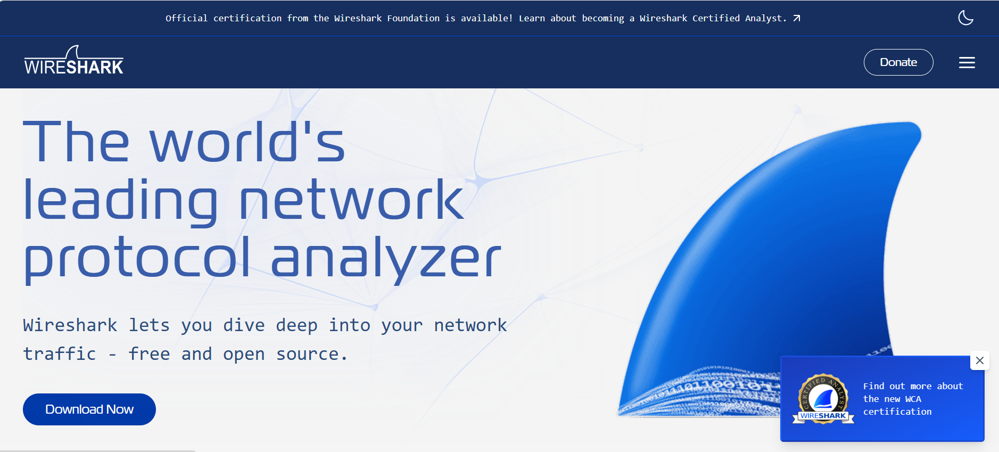
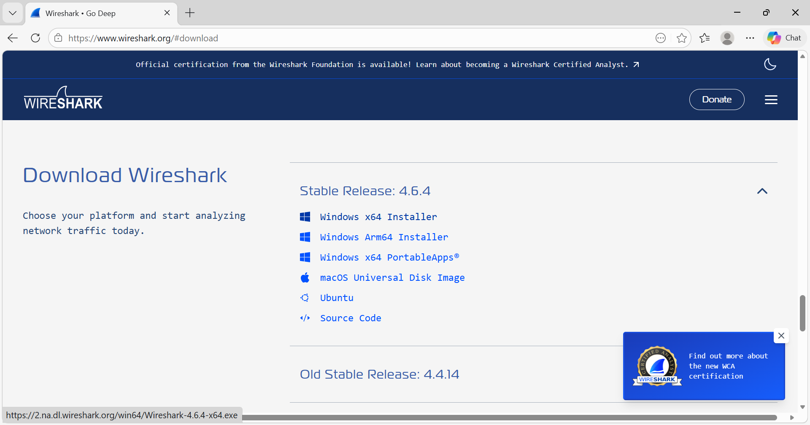
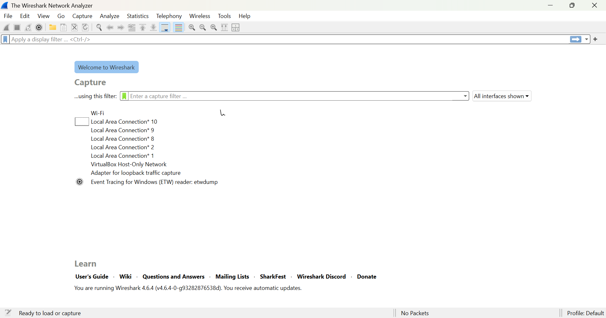
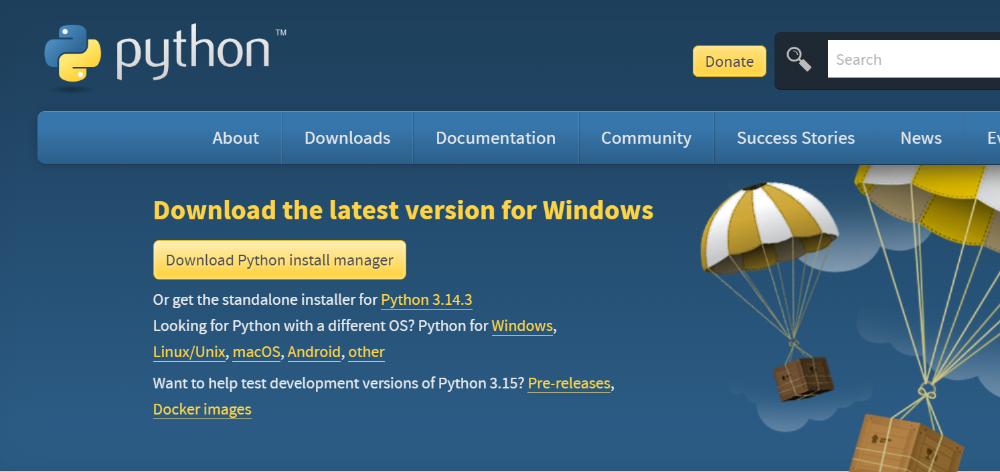
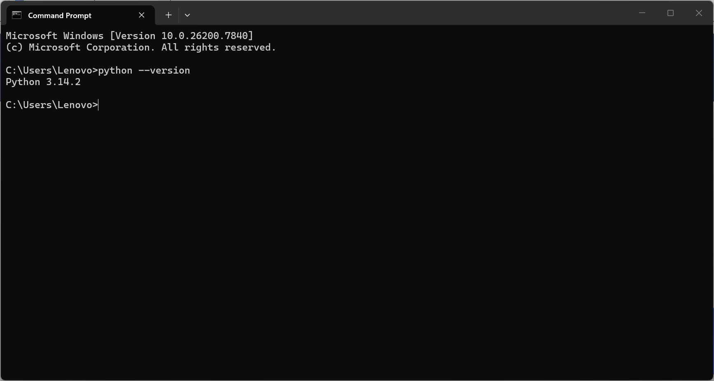

# LAPORAN PRAKTIKUM MODUL 1

Nama: Glory Leonthine Angi
NIM: 103072400058

## Tujuan Praktikum
Mengetahui tools yang akan digunakan dan memastikan tools berfungsi dengan baik selama pelaksanaan praktikum.

## Instalasi Tools

**Instalasi Wireshark**
1. Download aplikasi wireshark pada link berikut: http://www.wireshark.org/.
## Lampiran:

2. Pilih menu download sesuai dengan versi komputer kita (Windows/Mac/Linux).
## Lampiran:
 
 
3. Jalankan file yan diunduh dan klik "next" hingga semua alur proses instalasi selesai.

4. Buka aplikasi wireshark untuk mengetahui apakah aplikasih dapat berjalan dengan baik.
### Lampiran:
 

**Instalasi Python**
1. Download aplikasi Python pada link berikut: https://www.python.org/downloads/.
### Lampiran:

2. Pilih versi python terbaru

3. Pilih menu download sesuai dengan versi komputer kita (Windows/Mac/Linux).

4. Jalankan file yan diunduh dan klik "next" hingga semua alur proses instalasi selesai.

5. Saat instalasi berlangsung, pastikan mencentang "add python to path" agar python dapat dijalankan lewat command prompt.

6. Setelah instalasi selesi, kita dapat mengecek apakah intalasi kita berhasil dengan cara membuat command prompt lalu ketik "python --version". Jika muncul versi python berarti instalasi berhasil.
### Lampiran:

