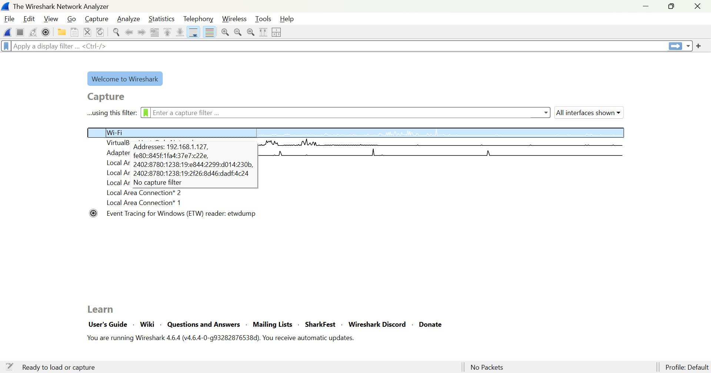

# LAPORAN PRAKTIKUM MODUL 2

**Nama: Glory Leonthine Angi
NIM: 103072400058**

## Tujuan Praktikum
Menggunakan wireshark untuk mengamati dan menganalisis paket data dalam jaringan komputer.

## Menjalankan Wireshark:
1. Jalankan aplikasi wireshark

2. Pada tampilan awal, dibawah capture terdapat daftar interface, klik dua kali pada interface **"Wi-Fi"**.
   #### Lampiran tampilan awal:

Wireshark akan langsung mulai menangkap paket data yang lewat melalui koneksi Wi-Fi.
#### Lampiran capture:
.png)

4. Setelah memulai pengambilan paket data, kita dapat menghentikannya dengan cara mengklik ikon **"kotak merah"** disebelah sirip wireshark.
   
#### Lampiran menghentikan capture:
.png)

5. Untuk menjalankan kembali, klik ikon **"sirip wireshark"** dan pilih **"continue without saving"** jika tidak ingin menyimpan hasil sebelumnya.
   
#### Lampiran menjalankan kembali apk wireshark:   
.png)

### **Catatan:** 
Jika komputer tidak terhubung ke koneksi Wi-Fi, proses capture akan otomatis berhenti. Jika koneksi WI-Fi tersambung kembali, wireshark akan melanjutkan penangkapan paket tanpa perlu memulai ulang.

#### Lampiran tanpa koneksi Wi-Fi: 
.png)

#### Lampiran koneksi Wi-Fi:
.png)

5. Untuk menghasilkan lalu lintas jaringan, buka browser dan masukkan URL: http://gaia.cs.umass.edu/wiresharklabs/INTRO-wireshark-file1.html 

### **Catatan:**
- Jika URL otomatis berubah menjadi **"https"**, halaman tidak akan menampilkan pesan **"Congratulations! You've downloaded the first Wireshark lab file!"**. Pastikan huruf **"s"** dihapus sehingga tetap menggunakan "**http**".
  
#### Lampiran https error:
.png)

- Jika sudah diubah ke http tetapi masih error, lakukan langkah ini:
  
    1. Klik kanan di browser > pilih **"Inspect"**.
       
    #### Lampiran inspect:   
    .png)

    3. Masuk ke menu **"Application"** > **"Cookies"**.

    4. Klik kanan pada cookies browser yang ada, lalu pilih **"Clear"**.
       
    #### Lampiran Application & clear cookies:
  .png)

    5. Refresh halaman.
    #### Lampiran error teratasi:
  .png)

- Jika masih error, coba gunakan aplikasi lain untuk membuka.

6. Setelah halaman berhasil ditampilkan di browser, kembali ke aplikasi wireshark dan hentikan proses capture agar data tidak terus bertambah.

7. Ketik **"http"** di kolom display filter lalu tekan enter. Wireshark akan menampilan paket HTTP saja.

8. Cari alamat URL yang sebelumnya dimasukkan muncul di daftar paket. Jika terbaca, berarti proses berhasil.

#### Lampiran paket HTTP & URL muncul:
.png)

10. Cari paket dengan info bertulisan **"HTTP/1.1 200 OK (text/html)"** dan length sekitar 499.

#### Lampiran HTTP ditemukan:
.png)

12. Klik paket tersebut, lalu pada detail protokol HTTP akan menampilkan pesan “Congratulations! You've downloaded the first Wireshark lab file!” seperti pada browser yang telah kita buka tadi.

#### Lampiran pesan berhasil ditampilkan:
.png)

14. Running berhasil dan keluar dari wireshark.
