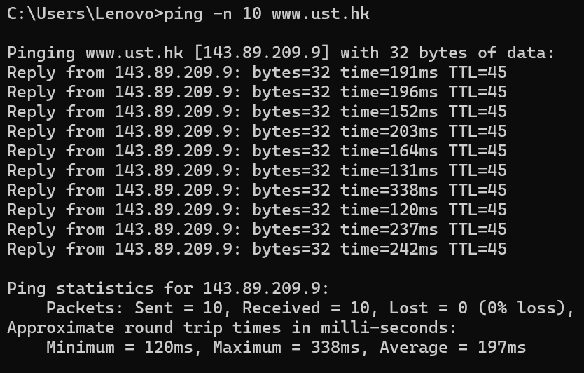
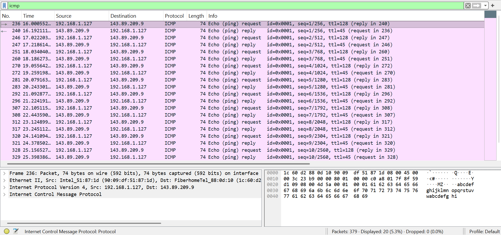
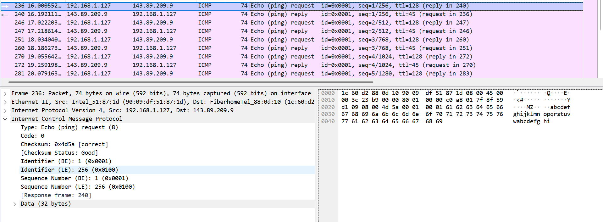
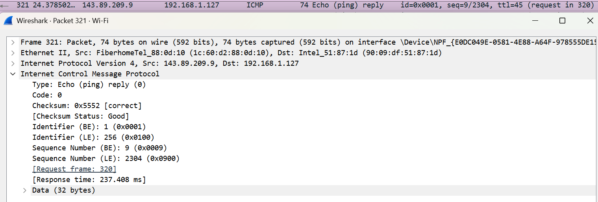
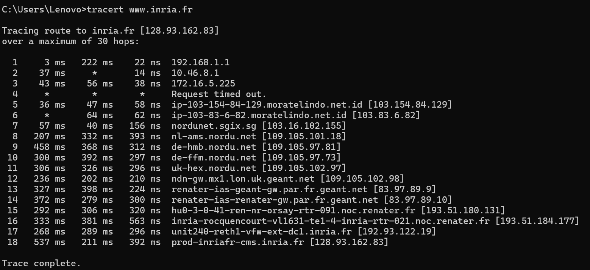
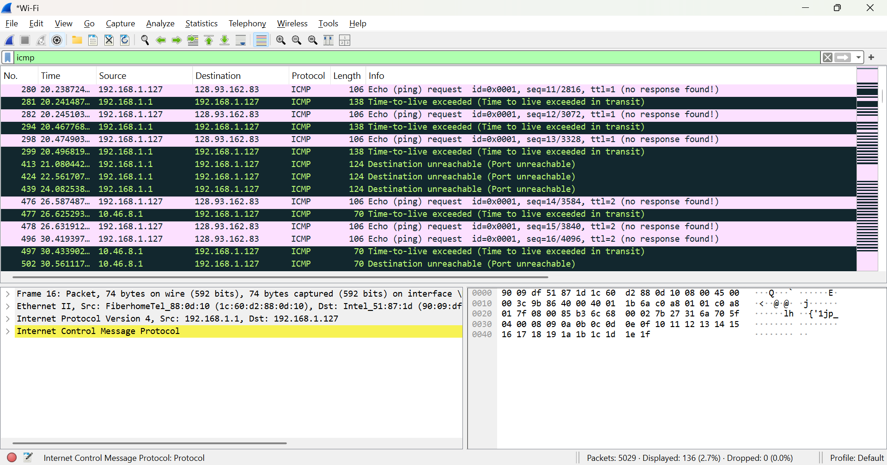
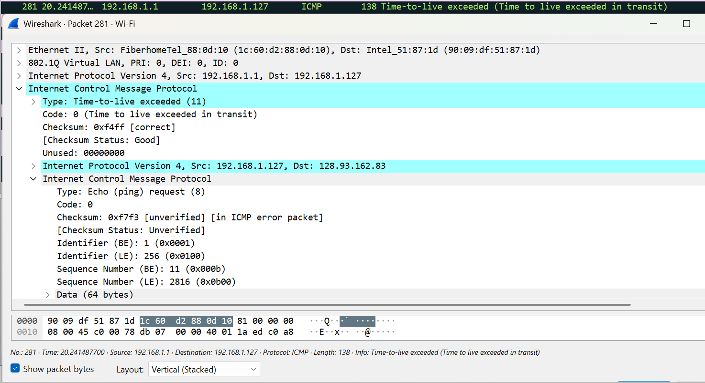

# LAPORAN PRAKTIKUM MODUL 12

#### Nama: Glory Leonthine Angi - 103072400058

## Tujuan:
1. Mahasiswa dapat menginvestigasi cara kerja protokol ICMP menggunakan Wireshark
2. Mahasiswa dapat membuat program ICMP Pinger

### ICMP dan Ping
1. jalankan aplikasi wireshark.
2. buka cmd dan jalankan "ping -n 10 www.ust.hk"

3. kembali ke wireshark dan hentikan capture.
4. lakukan filter dengan mengetik "icmp"

hasil filter menampilkan tepat 20 paket data.paket-paket ini berpasangan secara teratur membentuk urutan interaksi request-reply sebanyak 10 kali operasional dari no. paket 236 hingga no. paket 329.

#### Analisis hasil ICMP dan Ping
1. ICMP Echo Request (Paket Nomor 236)

- **Type & Code:**
paket permintaan ini memiliki type echo (ping) request (8) dan code 0.
- **Checksum:**
nilai checksum adalah 0x4d5a dengan keterangan [Checksum Status: Good] yang menunjukkan bahwa paket tidak mengalami kerusakan.
- **Identifier & Sequence Number:**
nilai sequence number (BE) bernilai 1 (0x0001), berfungsi sebagai ID unik paket agar sistem operasi klien dapat mengenali bahwa balasan yang datang nanti adalah pasangannya.

2. ICMP Echo Reply (Paket Nomor 321):

- **Type & Code:**
paket balasan dari server ini memiliki type echo (ping) reply (0) dan code 0.
- **Checksum:**
nilai checksum adalah 0x5552 dengan keterangan [Checksum Status: Good], menandakan data balasan diterima secara utuh tanpa ada error biner.
- **Identifier & Sequence Number:**
nilai sequence number (BE) adalah 9 (0x0009), memastikan validitas paket.

### ICMP dan Traceroute
1. jalankan aplikasi wireshark
2. buka cmd dan jalankan "tracert www.inria.fr"

3. kembali ke wireshark dan hentikan capture.
4. lakukan filter dengan mengetik icmp

#### Analisis hasil ICMP dan Traceroute
analisis Paket Kesalahan ICMP (Paket Nomor 281)

- **Type & Code Utama:**
paket ini memiliki type time-to-live exceeded (11) dengan Code 0 (Time to live exceeded in transit)
- **Alamat IP Pengirim Error:**
paket kesalahan ini dikirim oleh Src: 192.168.1.1 menuju Dst: 192.168.1.127
- **Checksum:**
nilai checksum paket error ini adalah 0xf4ff[correct].

##### kesimpulan
Tracert di Windows mengirim paket ICMP Echo Request dengan nilai TTL yang bertambah satu per satu. Saat TTL habis, router akan mengirim pesan ICMP Time Exceeded, sehingga komputer dapat mengetahui setiap router (hop) yang dilewati menuju tujuan.
