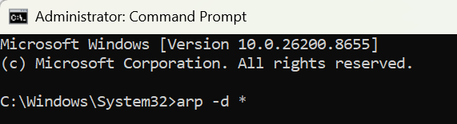
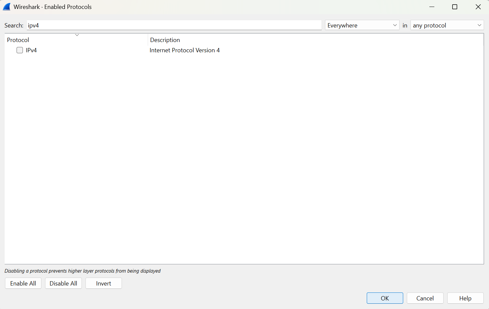
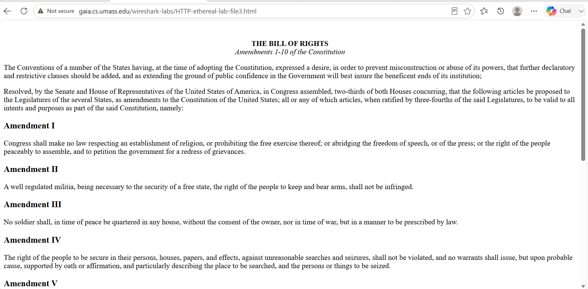
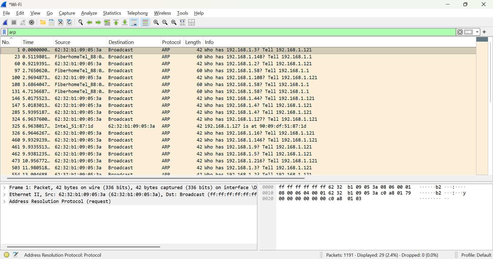
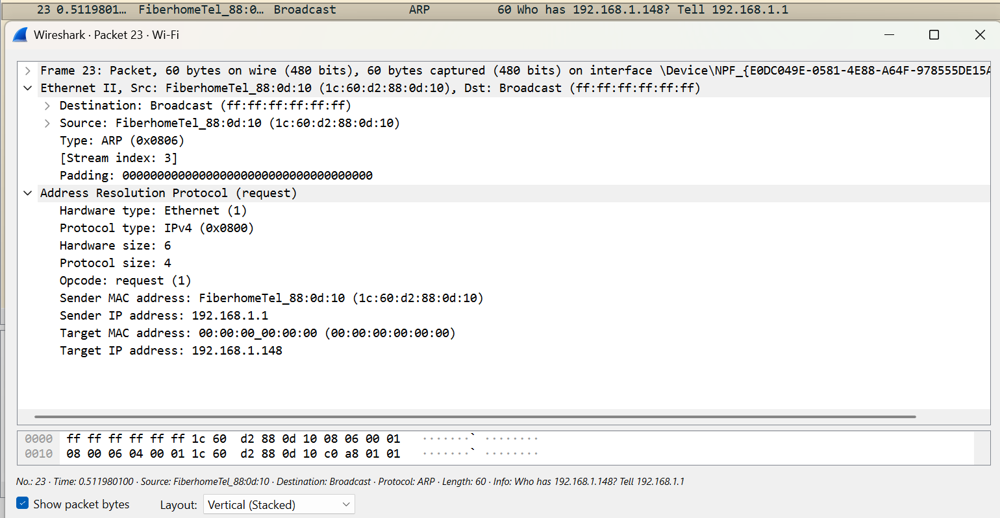

# LAPORAN PRAKTIKUM MODUL 13

#### Nama: Glory Leonthine Angi - 103072400058

## Tujuan:
Mengamati proses komunikasi Ethernet dan ARP, serta menganalisis paket ARP Request dan ARP Reply menggunakan Wireshark.

### Analisis ARP pada Wireshark 
1 . Membuka Command Prompt sebagai Administrator, kemudian menjalankan perintah _arp -d *_ untuk menghapus seluruh isi ARP Cache.

2. Membuka aplikasi Wireshark, lalu memilih Analyze → Enabled Protocols dan memastikan protokol IPv4 dinonaktifkan.

3. Memulai proses capture pada Wireshark.
4. Membuka browser dan mengakses halaman: http://gaia.cs.umass.edu/wireshark-labs/HTTP-ethereal-lab-file3.html

5. Hentikan proses capture setelah halaman berhasil dimuat.
6. Melakukan filter **arp** pada Wireshark.

7. Memilih salah satu paket ARP untuk diamati.

Berdasarkan hasil capture Wireshark, paket yang dipilih merupakan ARP Request dengan Opcode = Request (1). Paket dikirim dari perangkat beralamat IP 192.168.1.1 menuju alamat broadcast (ff:ff:ff:ff:ff:ff) untuk mencari MAC Address dari perangkat dengan IP 192.168.1.148. Target MAC Address masih bernilai 00:00:00:00:00:00 karena alamat tersebut belum diketahui. Dari hasil ini dapat disimpulkan bahwa ARP Request digunakan untuk meminta informasi MAC Address sebelum data dapat dikirim ke perangkat tujuan melalui jaringan Ethernet.
