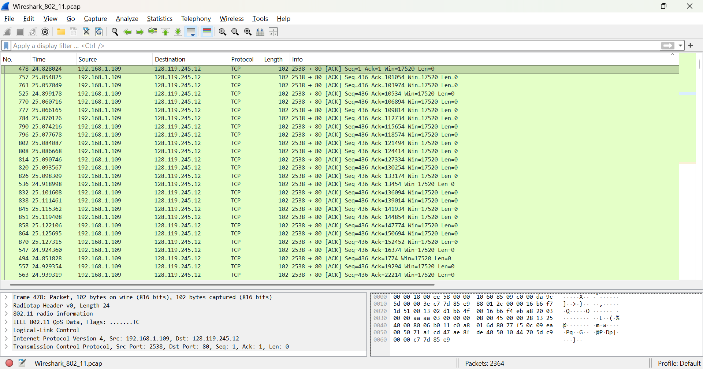
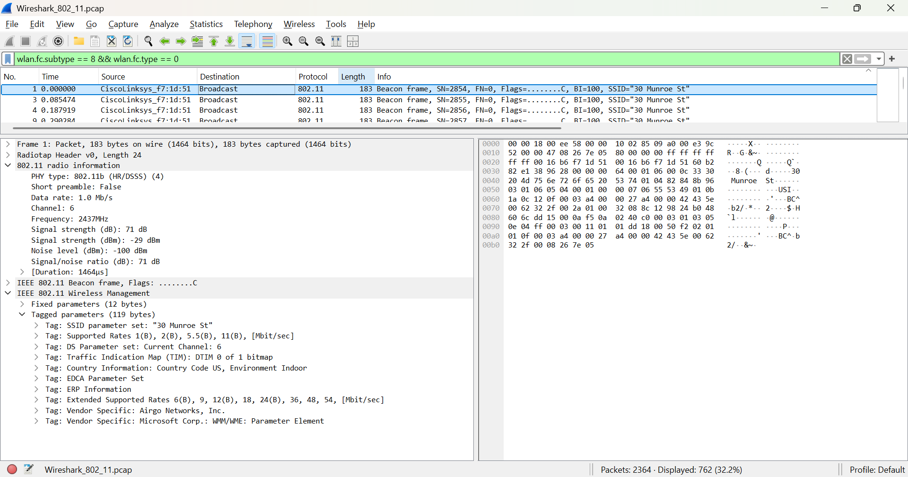
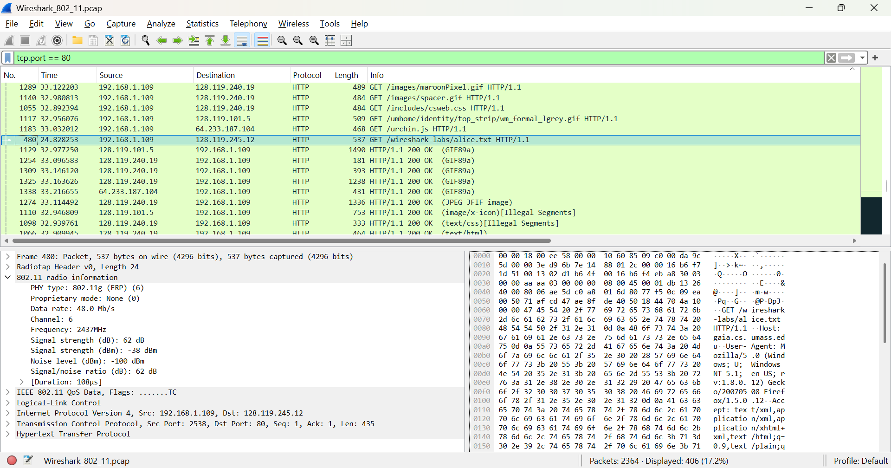
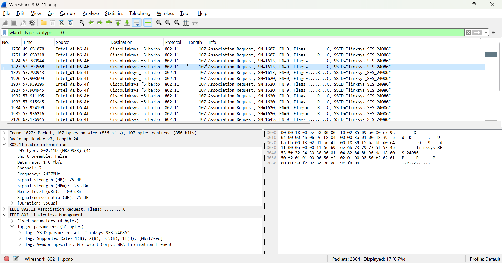
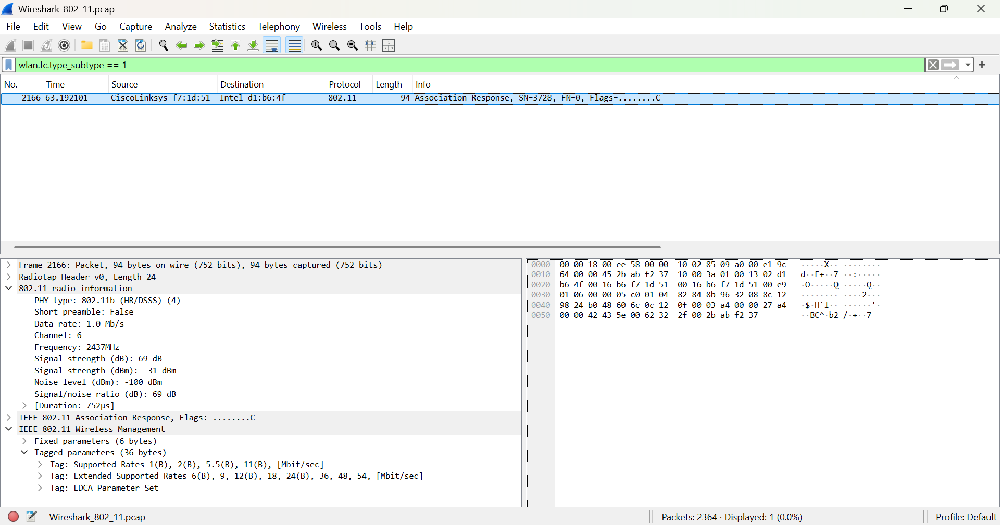
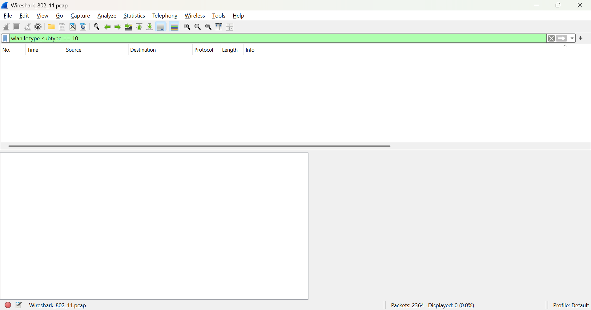

# LAPORAN PRAKTIKUM MODUL 14

#### Nama: Glory Leonthine Angi - 103072400058

## Tujuan:
1. Menganalisis fungsi dan tipe frame pada protokol jaringan nirkabel IEEE 802.11 (WiFi) menggunakan Wireshark.
2. Memahami mekanisme Beacon Frame, transfer data, serta proses asosiasi/disosiasi pada jaringan nirkabel.

### Langkah-Langkah Analisis:
1. Mengunduh file zip http://gaia.cs.umass.edu/wireshark-labs/wireshark-traces.zip dan ekstrak file
2. Buka file dan cari file Wireshark_802_11.pcap - klik kanan - open with wireshark

### Pengamatan Beacon Frames
Memasukkan filter: **wlan.fc.subtype == 8 && wlan.fc.type == 0** pada Wireshark.

Berdasarkan hasil pengamatan, paket yang dipilih merupakan Beacon Frame yang dikirim oleh access point CiscoLinksys_f7:1d:51 ke alamat Broadcast. Beacon Frame ini membawa informasi jaringan WiFi dengan SSID "30 Munroe St" pada channel 6 (2437 MHz) dengan Beacon Interval sebesar 100. Selain itu, frame juga menampilkan kemampuan jaringan, seperti kecepatan transmisi yang didukung hingga 54 Mbps. Hal ini menunjukkan bahwa Beacon Frame berfungsi untuk memberikan informasi mengenai keberadaan access point beserta konfigurasi jaringannya agar dapat dikenali oleh perangkat yang ingin terhubung.

### Pengamatan Data Frame
Memasukkan filter: **tcp.port == 80** pada Wireshark.

Berdasarkan hasil capture Wireshark, paket yang diamati merupakan Data Frame yang membawa paket HTTP GET dari client menuju server. Terlihat perangkat dengan IP 192.168.1.109 mengirim permintaan HTTP ke alamat IP 128.119.245.12 melalui port 80 untuk mengakses file /wireshark-labs/alice.txt. Paket dikirim melalui jaringan WiFi pada Channel 6 dengan kecepatan data 48 Mb/s. Hal ini menunjukkan bahwa Data Frame digunakan untuk membawa data pengguna setelah proses koneksi dengan access point berhasil dilakukan.

### Pengamatan Association Request
Memasukkan filter: **wlan.fc.type_subtype == 0** pada Wireshark.

Berdasarkan hasil capture Wireshark, paket yang diamati merupakan Association Request yang dikirim oleh perangkat client (Intel_d1:b6:4f) kepada access point CiscoLinksys_f5:ba:bb. Paket ini berisi permintaan untuk bergabung ke jaringan WiFi dengan SSID "linksys_SES_24086". Selain SSID, paket juga membawa informasi seperti supported rates yang didukung oleh client. Hal ini menunjukkan bahwa Association Request digunakan sebagai tahap awal agar client dapat terhubung ke access point.

### Pengamatan Association Response
Memasukkan filter: **wlan.fc.type_subtype == 1** pada Wireshark.

Berdasarkan hasil capture Wireshark, paket yang diamati merupakan Association Response yang dikirim oleh access point CiscoLinksys_f7:1d:51 kepada client Intel_d1:b6:4f. Paket ini merupakan balasan atas permintaan asosiasi yang sebelumnya dikirim oleh client. Pada paket ini access point mengirimkan informasi seperti supported rates yang dapat digunakan selama komunikasi. Hal ini menunjukkan bahwa access point menerima permintaan asosiasi sehingga client dapat melanjutkan proses komunikasi pada jaringan WiFi.

### Pengamatan Disassociation
Memasukkan filter: **wlan.fc.type_subtype == 10** pada Wireshark.

Berdasarkan hasil pencarian, tidak ditemukan paket Disassociation pada file capture. Hal ini menunjukkan bahwa proses pemutusan koneksi tidak direkam sebagai frame Disassociation pada trace ini, sehingga analisis difokuskan pada Beacon Frame, Data Frame, Association Request, dan Association Response.