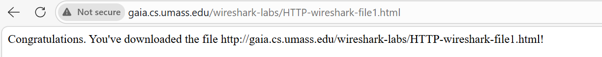

# LAPORAN PRAKTIKUM MODUL 3

**Nama: Glory Leonthine Angi'**
**NIM: 103072400058**

## Tujuan Praktikum
Menggunakan Wireshark untuk mempelajari protokol HTTP yang sedang berjalan.

## Persiapan
1. Jalankan aplikasi **wireshark**.
2. Pilih **interface jaringan** yang sedang kamu gunakan untuk internet (misalnya **Wi-Fi**).
3. Klik 2 kali pada interface tersebut untuk memulai menangkap paket.
4. Pada bagian atas jendela wireshark, ketik **http** di kolom display filter, lalu tekan enter.
5. Hentikan proses capture dengan **klik kotak merah** agar tidak ada paket lain yang ikut terekam.
6. **Klik start** lagi sebelum membuka browser.
7. Buka browser untuk mengakses alamat yang digunakan pada masing-masing percobaan.
8. Setelah proses pengamatan selesai, hentikan capture pada wireshark dengan **klik stop**.

## 3.1. Basic HTTP GET/response interaction

1. Buka browser dibawah ini untuk mengakses alamat:

http://gaia.cs.umass.edu/wireshark-labs/HTTPwireshark-file1.html

#### lampiran halaman browser basic http get:

#### catatan:

**pastikan browser yang di akses bertulisan _**http**_ bukan _**https**_ agar tidak terjadi error saat mengakses browser.**

2. Setelah halaman muncul, kembali ke wireshark dan klik stop untuk menghentikan capture

3. Cari **Get request** dari browser dan balasan **HTTP Response** dari server:

- Jika berhasil, response akan berstatus **200 OK** yang berarti tidak ada error dan menampilkan isi file yang ada pada browser

#### lampiran berhasil akses

.png)

- Jika terjadi error, response akan berstatus **404 Not Found**, server tidak menemukan file yang diminta. 
#### lampiran error saat akses

.png)

.png)

## 3.2.  HTTP CONDITIONAL GET/response interaction 

1. Buka browser dibawah ini untuk mengakses alamat:
   
http://gaia.cs.umass.edu/wireshark-labs/HTTPwireshark-file2.html

browser akan menampilkan file HTML dengan 5 baris

#### lampiran halaman browser HTTP Conditional

.png)

2. Kembali ke halaman browser dan refresh. 

3. Perhatikan hasil capture pada wireshark, akan muncul status dengan code **304 Not Modified**.

#### lampiran code 304 Not Modified
.png)

#### Catatan:
**Status code _**304 Not Modified**_ muncul karena browser masih menyimpan file di cache. Saat halaman dibuka kembali, browser hanya memeriksa apakah file di server berubah atau tidak, karena file tidak berubah, maka server tidak mengirim ulang file tersebut.**

### Cara Mengatasi:
- Klik kanan pada halaman browser.
- Buka **Inspect** > **Network** > **Aktifkan Disable cache**.

#### lampiran cara mengatasi code 304

.png)

- Refresh halaman.

4. Perhatikan kembali hasil capture pada wireshark. Setelah cache dinonaktifkan, respons akan berubah menjadi **200 OK**.

#### lampiran berhasil mengatasi code 304

.png)

## 3.3. Retrieving Long Documents 

1. Pastikan cache browser sudah dibersihkan terlebih dahulu agar hasil capture tidak mempengaruhi data yang tersimpan sebelumnya.

2. Buka browser dibawah ini untuk mengakses alamat:
   
http://gaia.cs.umass.edu/wireshark-labs/HTTPwireshark-file3.html

browser akan menampilkan dokumen HTML yang lebih panjang yaitu **THE BILL OF RIGHTS**.

#### lampiran halaman browser Retrieving Long Documents

.png)

3. Setelah halaman berhasil dibuka, kembali ke wireshark lalu **klik stop** untuk menghentikan capture.

4. Perhatikan hasil capture pada wireshark

#### lampiran hasil capture Retrieving Long Documents

.png)

#### catatan:

**Karena ukuran file lebih besar, data respons dikirim dalam beberapa paket _TCP_.**

## 3.4. HTML Documents dengan Embedded Objects 

1. Pastikan cache browser sudah dibersihkan terlebih dahulu agar hasil capture tidak mempengaruhi data yang tersimpan sebelumnya.

2. Buka browser dibawah ini untuk mengakses alamat:
   
http://gaia.cs.umass.edu/wireshark-labs/HTTPwireshark-file4.html

browser akan menampilkan file HTML yang berisi 2 gambar.

#### lampiran halaman browser Embedded Objects 

.png)

3. Setelah halaman berhasil dibuka, kembali ke wireshark lalu **klik stop** untuk menghentikan capture.

4. Perhatikan hasil capture pada wireshark.

#### lampiran hasil capture Embedded Objects 

.png)

#### catatan:
**Gambar pada halaman tidak langsung mejadi file HTML, tetapi diambil dari alamat URL lain. browser akan meminta file HTML terlebih dahulu, lalu melanjutkan dengan mengambil gambar yang ditampilkan pada halaman.**

## 3.5. HTTP Authentication

1. Pastikan cache browser sudah dibersihkan terlebih dahulu agar hasil capture tidak mempengaruhi data yang tersimpan sebelumnya.

2. Buka browser dibawah ini untuk mengakses alamat:
   
http://gaia.cs.umass.edu/wiresharklabs/protected_pages/HTTP-wireshark-file5.html

Saat login akan muncul, masukkan username: **wireshark-students** dan password: **network**

#### lampiran menu login

.png)

3. Setelah halaman berhasil dibuka, kembali ke wireshark lalu **klik stop** untuk menghentikan capture.

#### lampiran halaman berhasil dibuka

.png)

4. Perhatikan hasil capture pada wireshark.

#### lampiran hasil capture HTTP Authentication 

.png)

#### Catatan:
**Pada percobaan ini, browser mengirimkan informasi login melalui header authorization. Username dan password tidak dikirim dalam bentuk teks biasa, tetapi diubah ke dalam _**format base64**_. Format ini buka enkripsi sehingga data masih bisa dikembalikan ke bentuk aslinya dan kurang aman jika tidak menggunakan perlindungan tambahan.**
