# LAPORAN PRAKTIKUM MODUL 4

Nama: Glory Leonthine Angi'
NIM: 103072400058

## Tujuan Praktikum
Menginvestigasi cara kerja DNS dengan menggunakan Wireshark.

## Nslookup
1. Buka cmd
   
2. Ketik perintah **nslookup www.mit.edu**
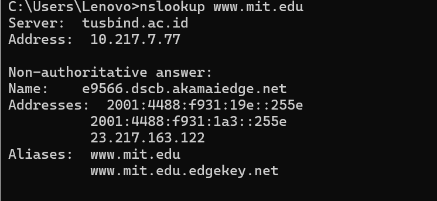

perintah ini berarti "tolong kirimkan alamat IP untuk host www.mit.edu". jawaban dari perintah ini menyediakan dua informasi: (1) nama dan alamat IP server DNS yang memberikan jawaban dari perintah yang dimasukkan; dan (2) jawaban dari perintah tersebut, berupa nama host dan alamat IP. 

3. Ketik perintah **nslookup –type=NS mit.edu**
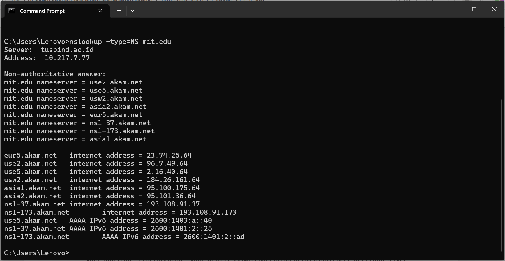

permintaan tersebut berarti, "tolong kirimkan saya nama host dari DNS otoritatif untuk mit.edu". perintah itu digunakan untuk mengetahui nama-nama server DNS otoritatif suatu domain, dan hasil yang ditampilkan bisa berupa jawaban cache (non-otoritatif) dan alamat IP server otoritatif.

4. Ketik perintah nslookup **www.aiit.or.kr bitsy.mit.edu**
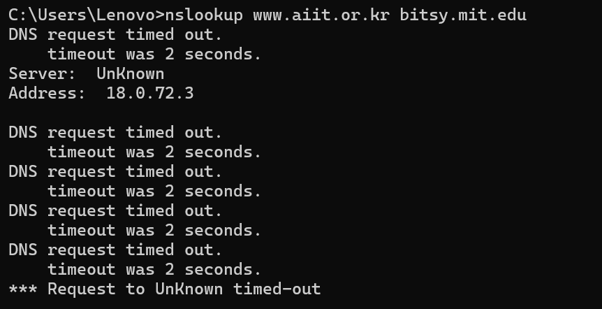

Permintaan DNS diarahkan langsung ke server DNS bitsy.mit.edu, bukan ke server DNS lokal/default. Karena permintaan dikirim langsung, jawaban yang diterima adalah hasil otoritatif dari server MIT.

5. Ketik perintah **nslookup –option1 –option2 host-to-find dns-server** 
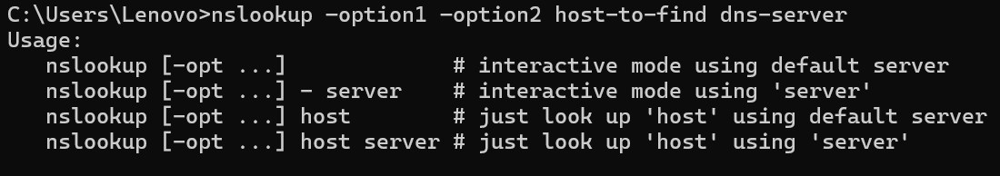

Sintaks nslookup pada dasarnya memberi kebebasan untuk menentukan opsi pencarian (misalnya mau cari record A, NS, MX, dll), menentukan host atau domain yang ingin dicari informasinya, menentukan server DNS tujuan (kalau tidak ditulis, otomatis pakai server DNS lokal).

###  Pengujian mandiri:
1. Berapa alamat IP server tersebut? 
Ketik perintah **nslookup www.kompas.com** pada cmd
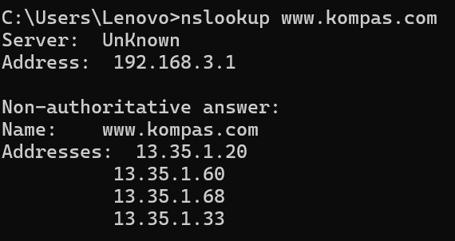

server tersebut memiliki 4 alamat IP aktif. Informasi ini diperoleh melalui server DNS lokal yang memberikan jawaban bersifat non authoritative, yang menandakan bahwa data tersebut diambil dari cache server DNS.

2. Server DNS otoritatif untuk universitas di Eropa. 
Ketik perintah **nslookup -type=NS cam.ac.uk** pada cmd
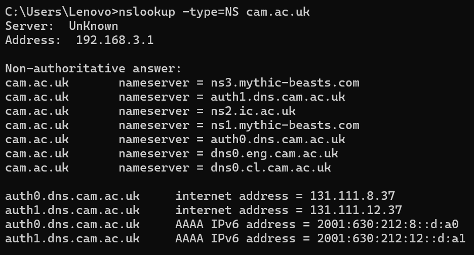

diketahui bahwa server DNS otoritatif untuk University of Cambridge (Eropa) adalah auth0.dns.cam.ac.uk dengan alamat IP 131.111.8.37 dan auth1.dns.cam.ac.uk dengan alamat IP 131.111.12.37. Server inilah yang memegang seluruh informasi domain di kampus tersebut.

3. Informasi mengenai server email dari Yahoo! Mail. Apa alamat IP-nya?  
Ketik perintah **nslookup -type=MX yahoo.com auth0.dns.cam.ac.uk** pada cmd
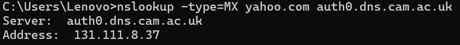

server tersebut memberikan respon query refused karena kebijakan keamanan internal kampus.Hasil ini menunjukkan adanya pembatasan akses pada server DNS otoritatif tertentu sehingga tidak semua permintaan dari jaringan luar dapat dilayani secara langsung.

## Ipconfig 
1. Buka cmd
2. Ketik perintah **ipconfig \all**
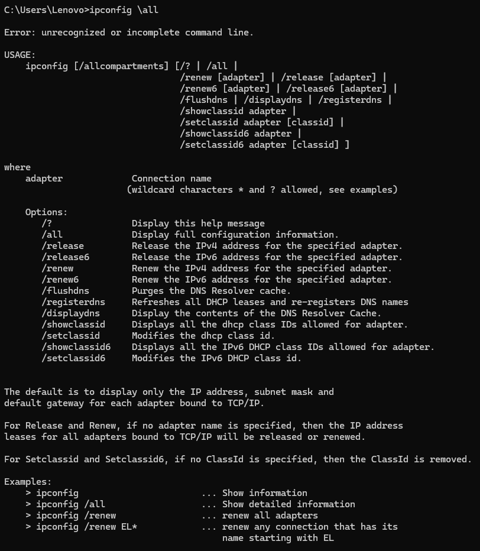

Perintah ini berfungsi untuk menampilkan detail teknis jaringan, termasuk alamat fisik perangkat (MAC Address) dan status apakah pengaturan IP bersifat otomatis (DHCP) atau manual.

3. Ketik perintah **ipconfig /displaydns**
   
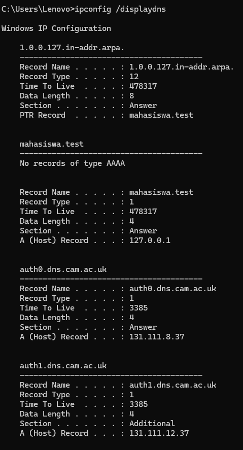

Perintah ini berfungsi untuk menampilkan cache DNS yang tersimpan di komputer. Daftar ini berisi alamat situs yang pernah dikunjungi agar komputer bisa membukanya kembali dengan lebih cepat tanpa harus bertanya ke server internet lagi.

4. Ketik perintah **ipconfig /flushdns**
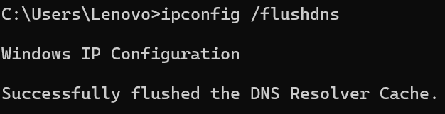

Perintah ini berfungsi untuk menghapus cache DNS di komputer. Tujuannya adalah untuk membersihkan data lama yang mungkin error dan memaksa komputer meminta alamat IP terbaru saat membuka situs web.

## Tracing DNS dengan Wireshark 
Langkah-langkah percobaan:
1. Ketik perintah **ipconfig /flushdns** melalui Command Prompt untuk menghapus data lama yang tersimpan.

3. Menghapus cache pada browser yang akan digunakan agar proses permintaan DNS dimulai dari awal.
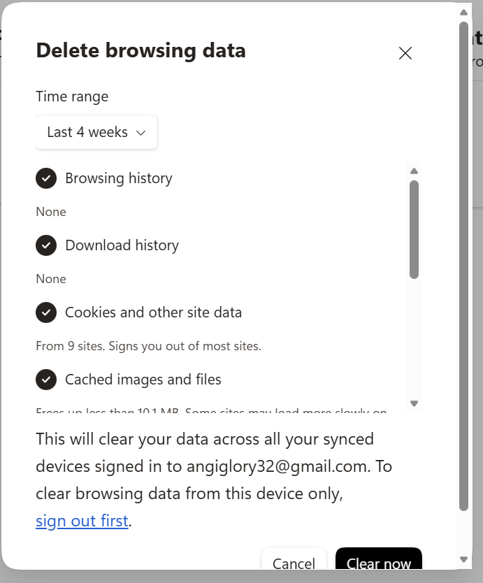
4. Ketik perintah **ipconfig** untuk mengetahui alamat IP laptop kita.
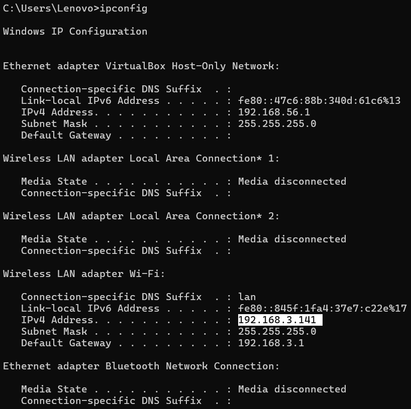
5. Buka aplikasi wireshark dan pilih jaringan yang digunakan.
6. Masukkan filter **ip.addr == [Masukkan_IP_Kamu]** untuk menyaring lalu lintas data.
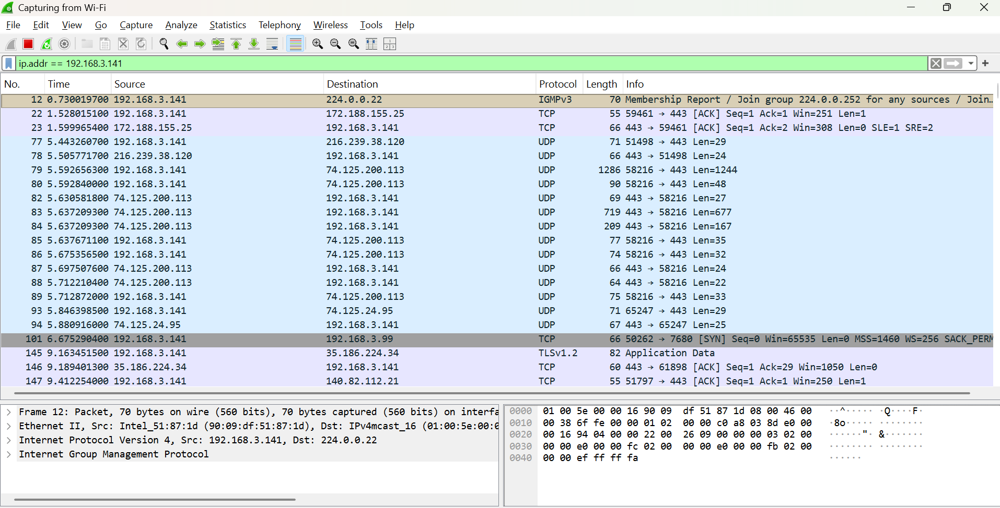
7. Tekan tombol Start Capture pada Wireshark untuk mulai merekam lalu lintas jaringan.
8. Buka browser dan kunjungi alamat **http://www.ietf.org**.

### Menjawab beberapa pertanyaan:
1. Cari pesan permintaan DNS dan balasannya. Apakah pesan tersebut dikirimkan melalui UDP 
atau TCP? 
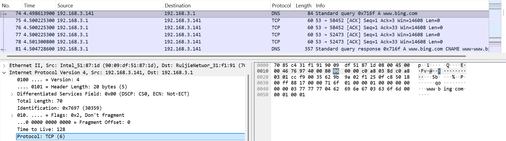

Pesan permintaan DNS pada no 74 dan balasannya pada no 81 dikirimkan melalui protokol TCP.

3. Apa port tujuan pada pesan permintaan DNS? Apa port sumber pada pesan balasannya? 

Port tujuannya adalah 53 dan port sumbernya adalah 52473.

5. Apa alamat IP tujuannya? Apa alamat IP server DNS lokal anda? Apakah kedua alamat IP tersebut sama? 

Alamat IP tujuannya adalah 192.168.3.1, karena ini sama dengan IP DNS server di ipconfig, sehingga keduannya sama.

7. Apa “jenis” atau ”type” dari pesan tersebut? Apakah pesan permintaan tersebut mengandung ”jawaban” atau ”answers”? 

jenis pesannya adalah Type A yang berarti komputer sedang meminta alamat IPv4 dan tidak mengandung jawaban.

9. Berapa banyak ”jawaban” atau ”answers” yang terdapat di dalamnya? Apa saja isi yang terkandung dalam setiap jawaban tersebut? 

terdapat 12 jawaban dan terdiri dari 3 record CNAME dan 9 record Type A.

11. Perhatikan paket TCP SYN yang selanjutnya dikirimkan oleh host Anda. Apakah alamat IP 
pada paket tersebut sesuai dengan alamat IP yang tertera pada pesan balasan DNS? 

ya, alamat paket TCP SYN sesuai dengan salah satu alamat IP yang sebelumnya diberikan oleh DNS dalam daftar jawaban. 

13. Apakah host Anda perlu mengirimkan pesan permintaan DNS baru setiap kali ingin mengakses suatu gambar? 

tidak ditemukan adanya paket protokol DNS tambahan

## Tracing DNS dengan perintah www.mit.edu 
Langkah-langkah percobaan:
1. Buka wireshark dan pilih jaringan yang digunakan.
2. Buka cmd dan ketik perintah **www.mit.edu**.
3. Hentikan wireshark dan pada kolom filter ketik dns.
4. Mencari permintaan dan jawaban untuk www.mit.edu.
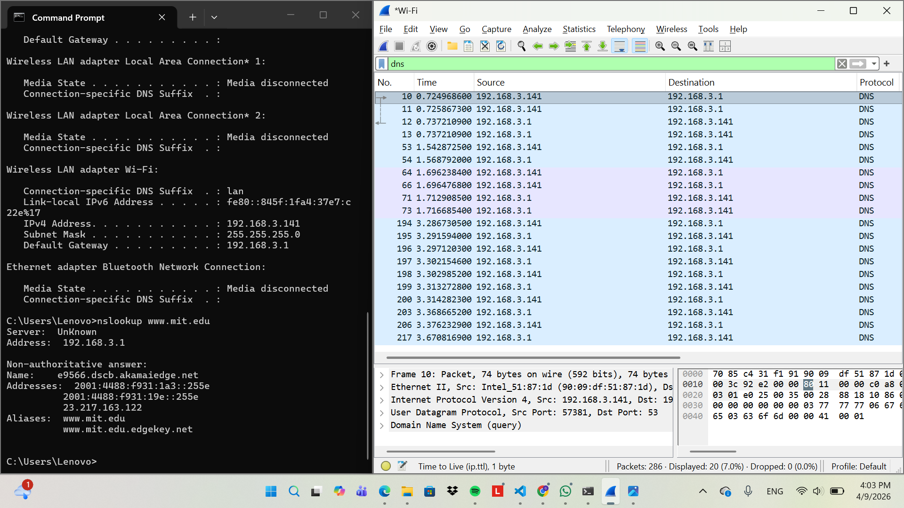

### Menjawab beberapa pertanyaan:
1. Port tujuan dan port sumber
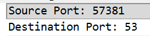
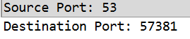

2. Alamat IP tujuan
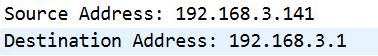

ya, ini adalah default alamat IP server DNS lokal saya.

4. Pemeriksaan pesan permintaan
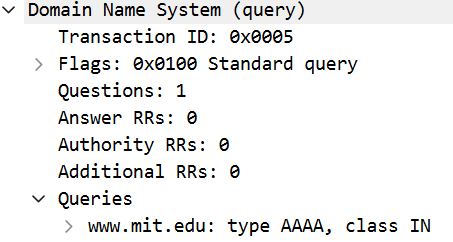

menunjukkan bahwa nslookup sedang meminta alamat IPv6 dan pesan tersebut tidak mengandung jawaban.

6. Pemeriksaan pesan balasan
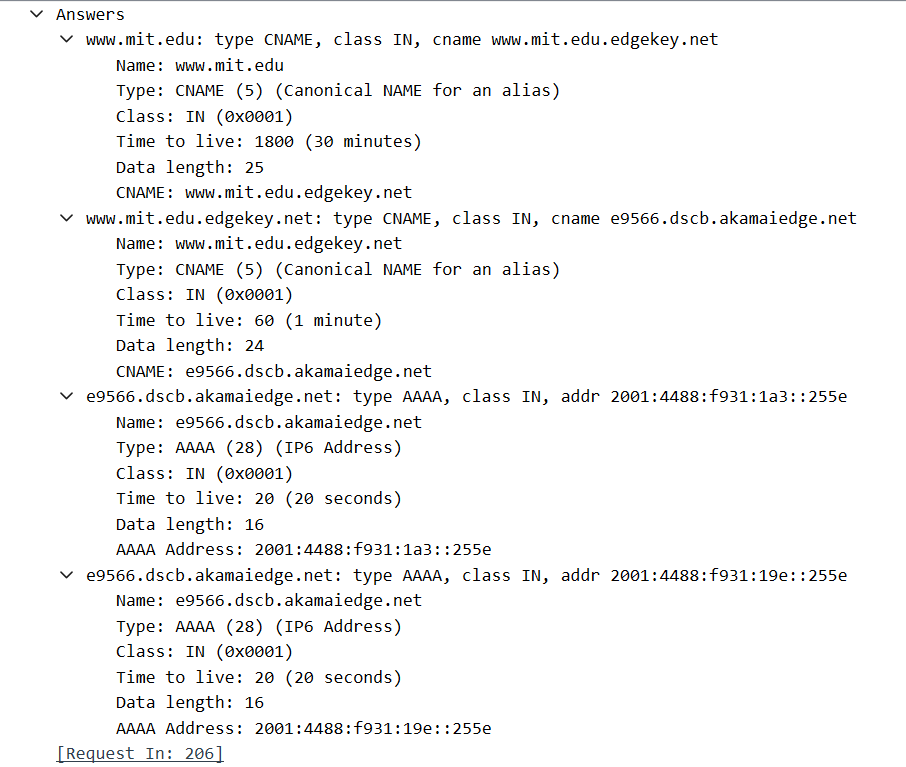

4 jawaban: 2 record name dan 2 record type AAAA

## Tracing DNS dengan perintah nslookup –type=NS mit.edu 
Langkah percobaan:
Ketik perintah **nslookup –type=NS mit.edu** pada cmd
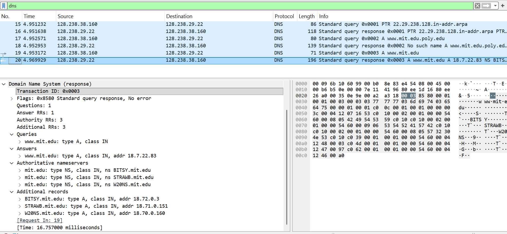
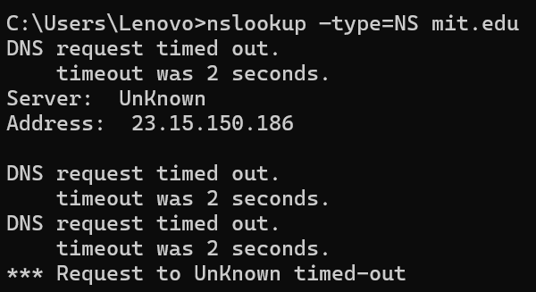

### Menjawab beberapa pertanyaan;
1. Alamat IP tujuan permintaan
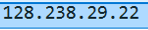

Pesan permintaan DNS dikirimkan ke alamat IP 128.238.29.22, alamat ini bukan default alamat IP saya.

3. Pemeriksaan pesan permintaan
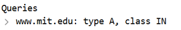

Type A dan tidak mengandung jawaban.

5. Pemeriksaan pesan balasan
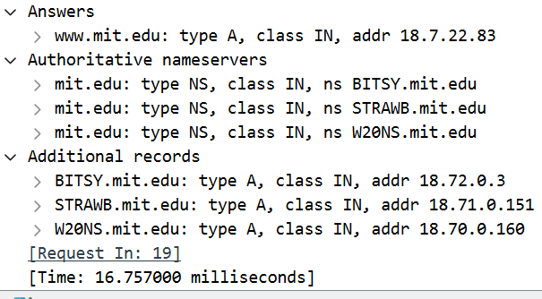

pesan balasan memberikan 3 nama server MIT dan memberikan alamat email

## Tracing DNS dengan perintah
Langkah percobaan:
Ketik perintah **nslookup www.aiit.or.kr bitsy.mit.edu**
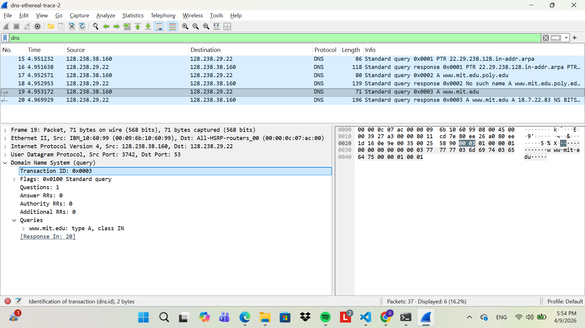
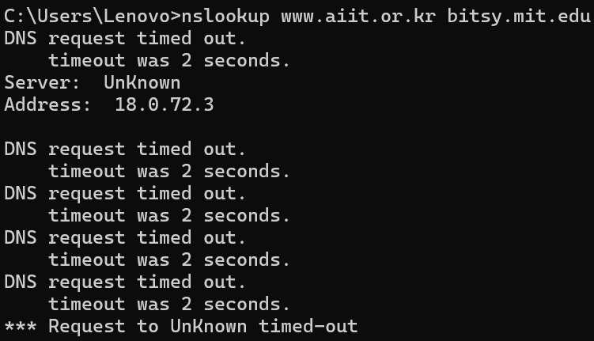

### Menjawab beberapa pertanyaan:
1. Alamat IPtujuan permintaan
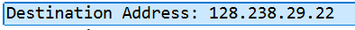

alamat ip bukan merupakan default alamat IP server DNS lokal saya.

3. Pemeriksaan pesan permintaan

type A dan tidak mengandung jawaban.

5. Pemeriksaan pesan balasan
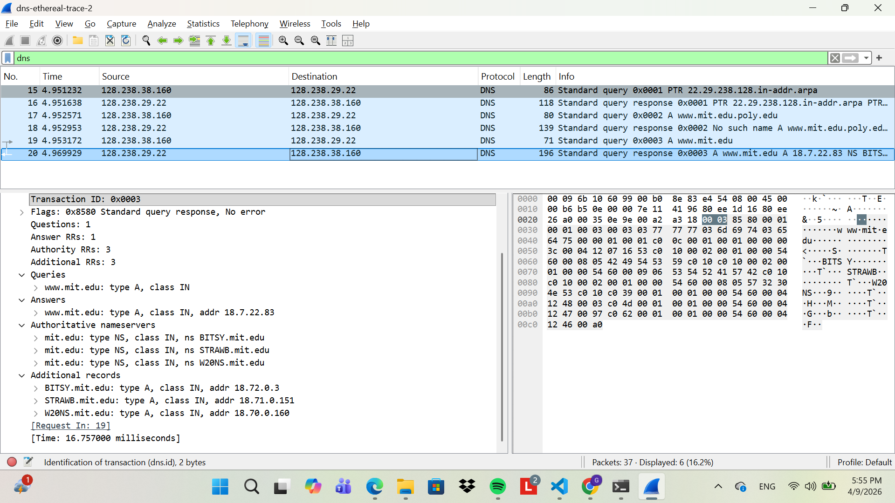

terdapat 1 jawaban berisi pemetaan nama www.mit.edu ke alamt IP
