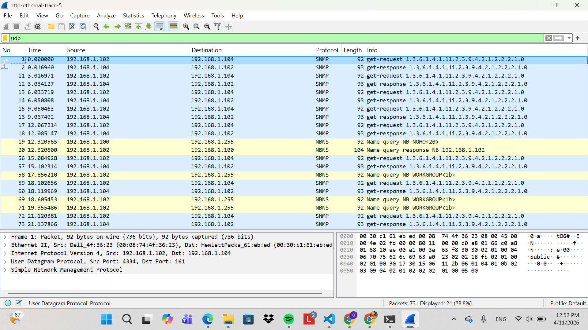
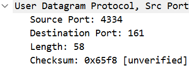
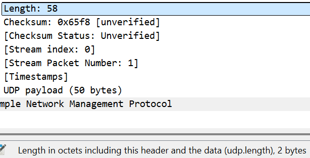
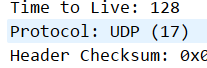
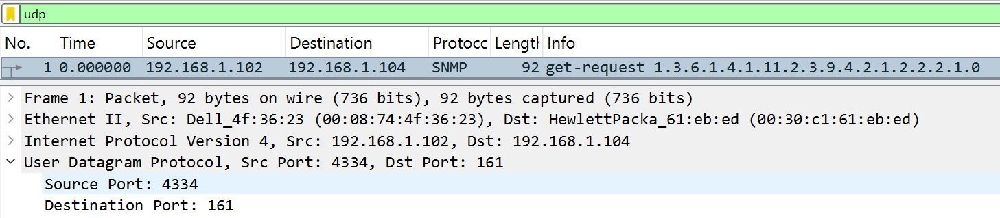
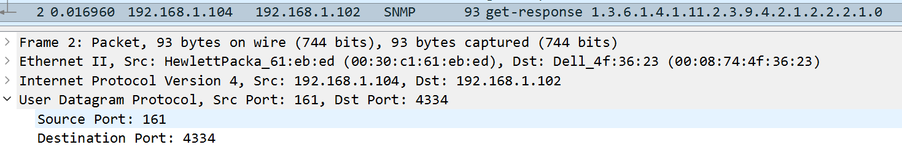

## LAPORAN PRAKTIKUM MODUL 5

Nama: Glory Leonthine Angi'
NIM: 103072400058

## Tujuan Praktikum:
Menganalisi cara kerja protokol UDP menggunakan wireshark

## Langkah-langkah percobaan:
1. Buka aplikasi wireshark dan pilih jaringan yang digunakan (Wi-Fi).
2. Download file **http://gaia.cs.umass.edu/wireshark-labs/wireshark-traces.zip** dan cari file **http-ethereal-trace-5**

3. Pada kolom filter ketik udp untuk menampilkan paket yang menggunakan UDP.

### Menjawab beberapa pertanyaan:
1. Field pada header UDP

terdapat 4 field utama

2. Panjang masing-masing field dalam byte

selisih length dan payload adalah 8 byte, karena ada 4 field di header, sehingga 8/4 = 2 byte per field.

3. Arti nilai "Length"
nilai length(58) adalah panjang total dari segmen UDP (header + payload) dan panjang length sesuai dengan nilai yang ada di header.

4. Payload maksimum UDP
ukuran header UDP: 8 byte
kapasitas maks field: 65.535 byte
jadi payload maksimalnya adalah = 65.535-8 = 65.527

5. Nomor port terbesar
nomor port terbesar yang dapat menjadi sumber adalah 65.535. Hal ini dikarenakan field source port pada header UDP memiliki ukuran 2 byte(16 bit), sehingga nilai maksimum yang dapat ditampung adalah 2^16-1 = 65.535.

6. Nomor protokol untuk UDP

nomor protokol untuk UDP adalah 17 dalam notasi desimal, atau 0x11 dalam notasi heksadesimal.

7. Hubungan nomor port

terlihat bahwa nomor port pada kedua paket tersebut saling bertukar posisi yang berarti adanya hubungan request - response yang konsisten.