## LAPORAN PRAKTIKUM MODUL 5

Nama: Glory Leonthine Angi'
NIM: 103072400058

## Tujuan Praktikum:
Menganalisis cara kerja protokol TCP menggunakan Wireshark.

## Transfer TCP
Langkah-langkah:
1. Download file http://gaia.cs.umass.edu/wireshark-labs/alice.txt

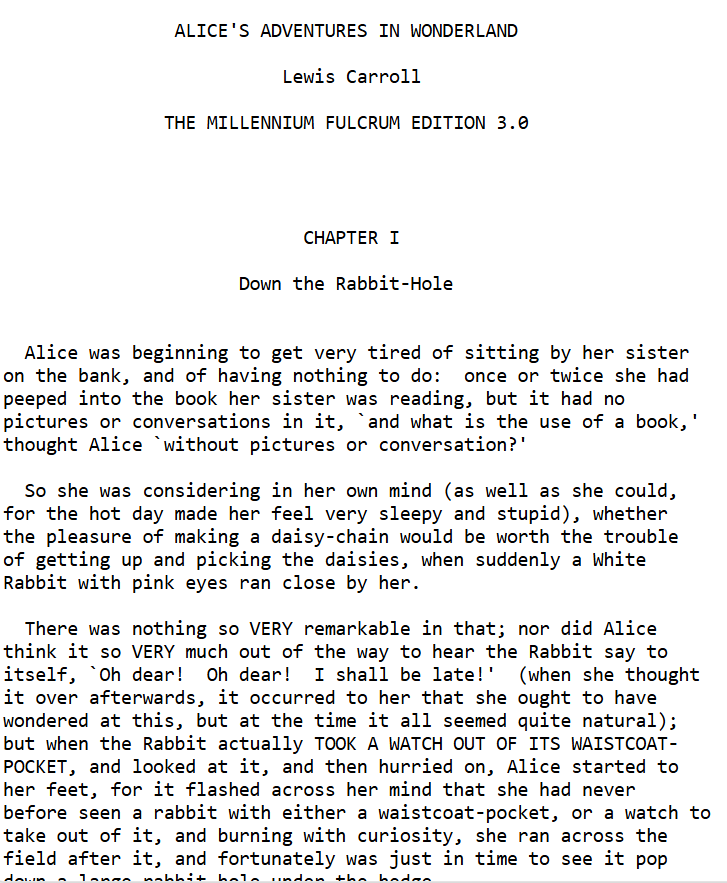

2. Buka http://gaia.cs.umass.edu/wireshark-labs/TCP-wireshark-file1.html
3. Pilih file alice.txt menggunakan tombol browse, tapi jangan klik upload dulu.

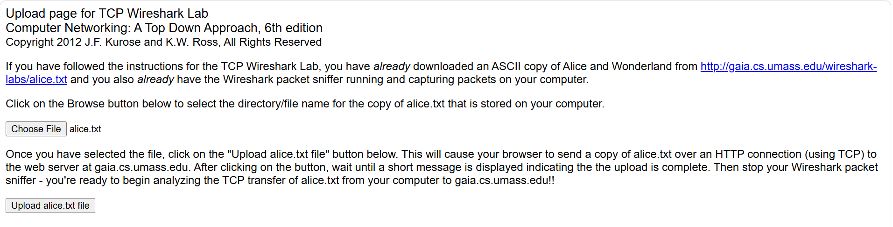

4. Jalankan wireshark, pilih interface internet yang digunakan.
5. Kembali ke browser, klik tombol upload alice.txt file. Tunggu sampai muncul pesan "Congratulations".

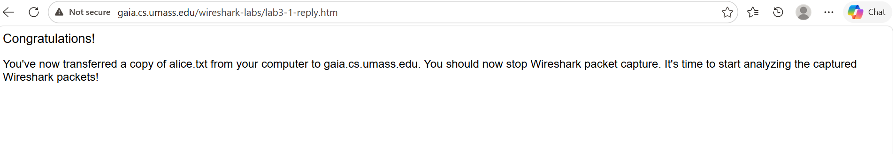

6. Kembali ke wireshark dan klik stop
7. Ketik tcp pada kolom filter untuk menampilkan semua segmen TCP.

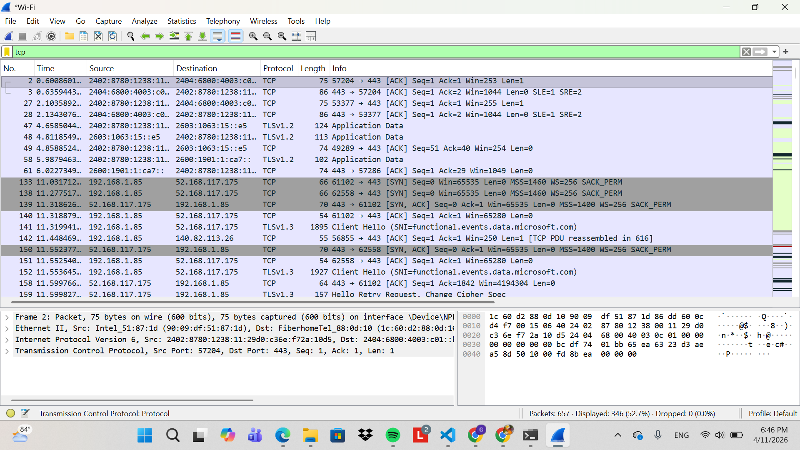

8. Cari paket dengan flag [SYN] di bagian awal paket.

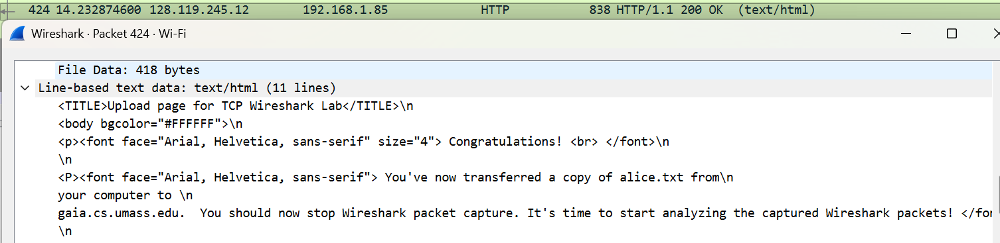

9. Cari paket dengan keterangan HTTP POST yang menunjukkan proses pengiriman file Alice.

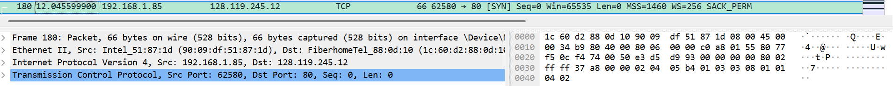

## Menjawab pertanyaan dengan menganalisis paket yang tertangkap pada trace 
1. Download file http://gaia.cs.umass.edu/wireshark-labs/wireshark-traces.zip 
2. Buka file **tcp- ethereal-trace-1**

## Pertanyaan dan jawaban:
1. IP dan Port Komputer Klien dengan filter "http"

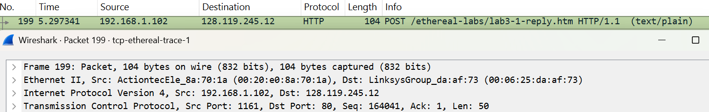

2. IP dan Port server dengan filter "http"

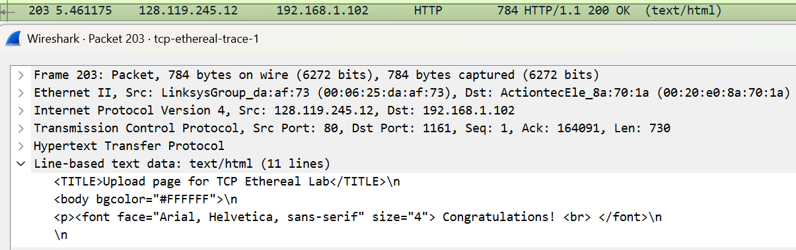

## Dasar TCP
1. Nomor urut segmen SYN

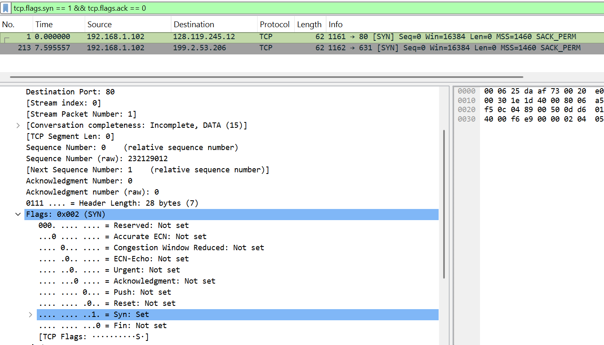

ditemukan sequence number segmen TCP SYN tersebut adalah 0, bit Syn bernilai 1 sementara bit Acknowledgment bernilai 0.

2. Segmen SYNACK dari server

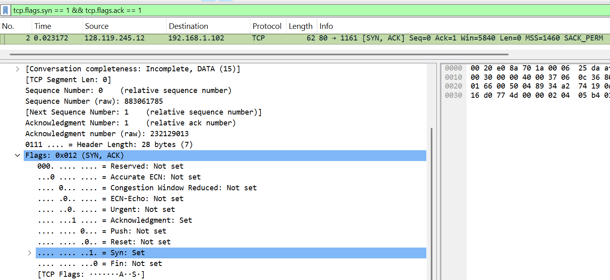

ditemukan sequence number segmen SYNACK adalah 0 dan nilai Acknowledgement adalah 1.

3. Nomor urut segmen HTTP POST

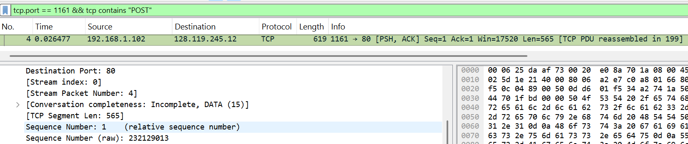

detail TCP menunjukkan relative sequence numbernya adalah 1.

4. Analisis 6 segmen pertama 

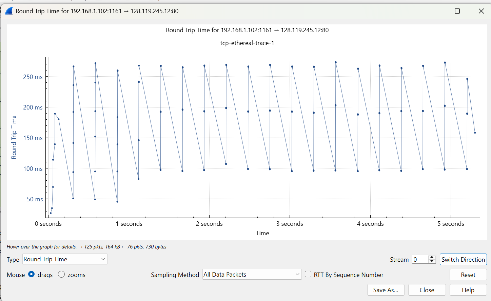

Statistics->TCP Stream Graph- >Round Trip Time 
Graph. Berdasarkan grafik RTT, nilai RTT selama proses transfer file ini berkisar antara 0 ms hingga sekitar 280 ms.

5. Panjang 6 segmen pertama

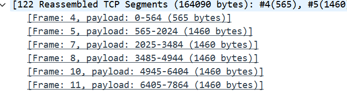

segmen 1: 565 bytes dan segmen 2-6: masing-masing berukuran 1460 bytes.

6. Buffer penerima

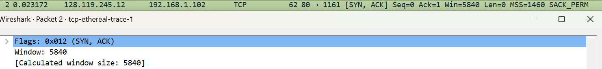

jumlah minimum 5840 byte. tidak menghambat pengirim karena tidak pernah melampaui batas window size yang tersedia selama seluruh proses transfer berlangsung.

7. Retransmisi

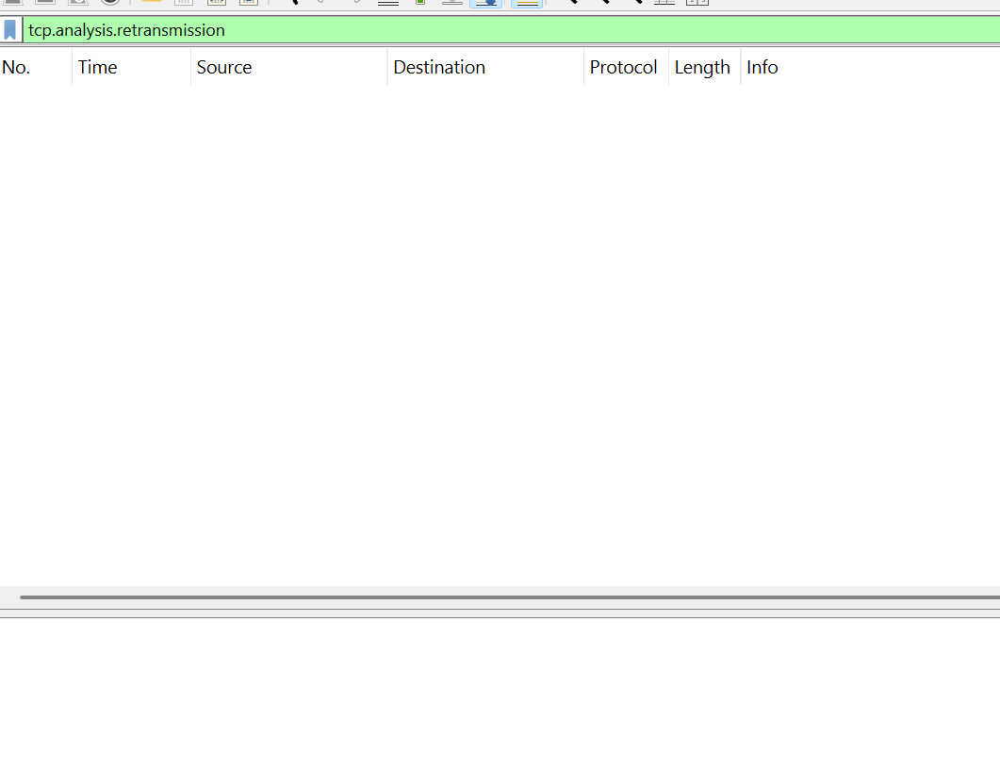

tidak ada segmen yang transmisikan ulang.

8. Data yang diakui

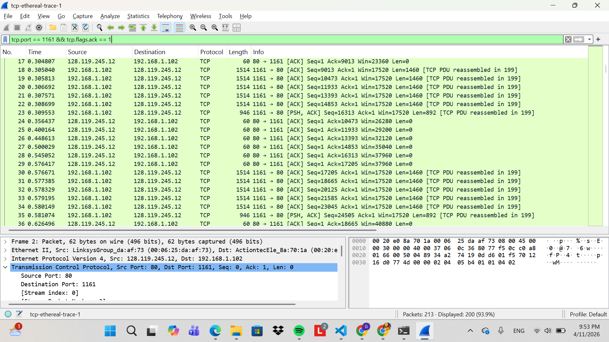

jumlah data yang diakui adalah 1460 byte (selisih dari paket no 24 dan 25). hal ini menunjukkan bahwa server melakukan ACK untuk setiap segmen data yang diterima.

9. Perhitungan throughput

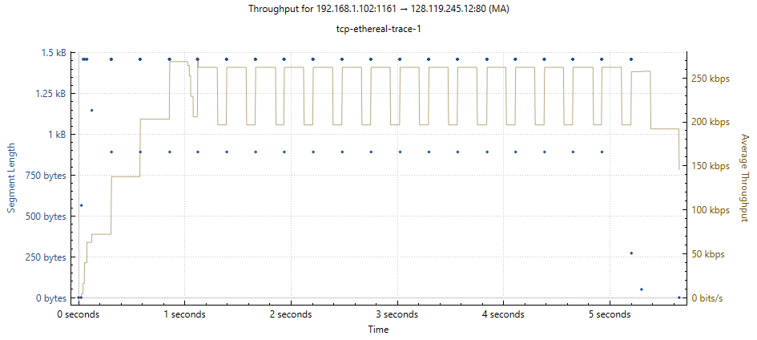

nilai throughput berada di kisaran 150 kbps hingga 250 kbps. Kecepatan transfer mengalami fase slow start di awal, lalu stabil di angka rata-rata 200 kbps.

## Congestion Control pada TCP
Langkah-langkah
- Buka file tcp-ethereal-trace-1 dengan wireshark
- Filter "tcp"
- Statistics->TCP Stream Graph-> Time-Sequence-Graph(Stevens).

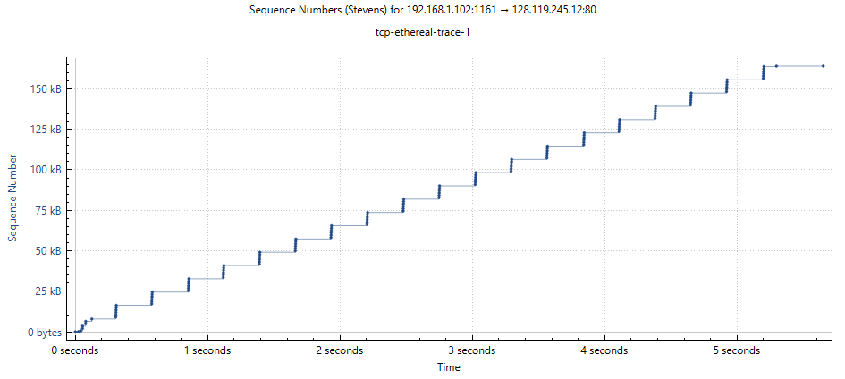

## Menjawab pertanyaan:
1. Identifikasi Slow Start & Congestion Avoidance
Pada awal pengiriman data (sekitar detik 0), terjadi fase slow start yang terlihat dari sequence number yang naik dengan sangat cepat. Setelah itu, masuk ke fase Congestion avoidance, di mana kenaikan nomor urut menjadi lebih stabil dan bertambah secara perlahan sampai akhir pengiriman. hal ini tidak sepenuhnya ideal karena ada jeda saat menunggu ACK.

2. Identifikasi Slow Start & Congestion Avoidance (menggunakan file alice)

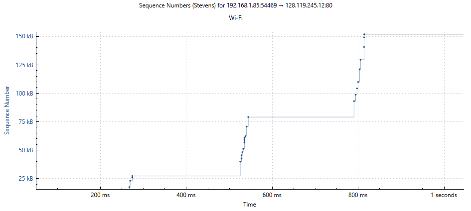

Grafik dari file alice menunjukkan pola tangga yang lebih curam dan memiliki jeda delay yang lebih lama dibandingkan dengan trace-1. hal ini biasa terjadi karena kestabilan koneksi internet.