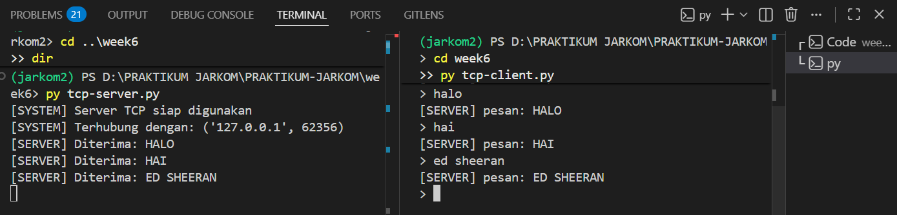
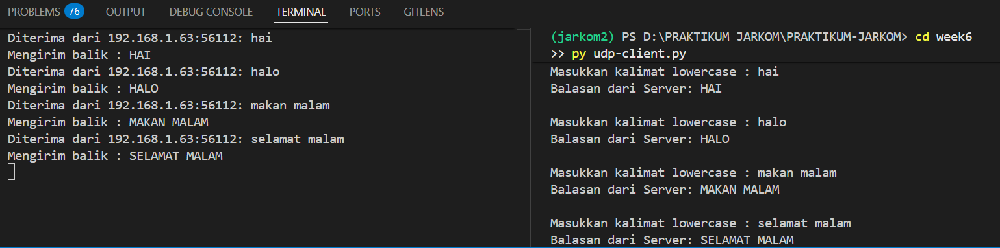

## LAPORAN PRAKTIKUM MODUL 7

#### Nama: Glory Leonthine Angi' - 103072400058

## Tujuan Praktikum:
1. Mahasiswa bisa membuat program berbasis socket UDP 
2. Mahasiswa bisa membuat program berbasis socket TCP 

## Socket Programming
Socket programming adalah metode komunikasi jaringan yang memungkinkan 2 atau lebih program untuk saling bertukar data melalui jaringan komputer. Terdapat 2 protokol transport utama yang digunakan dalam socket programming adalag TCP dan UDP.
Model Komunikasi:
- Server: menunggu koneksi/pesan dari client, memproses data yang diterima, kemudia mengirimkan balasan.
- Client: menginisiasi koneksi server, mengirimkan pesan, lalu menunggu balasan dari server

## TCP (Transmission Control Protocol)
### TCP Client
```python
# SOCKET = penjumlahan, pembagian, pengurangan, perkalian
from socket import *

serverName = "localhost"
serverPort = 12000 

# AF_INET = IPv4 | SOCK_STREAM = TCP
clientSocket = socket(AF_INET, SOCK_STREAM)

# connect ke server
clientSocket.connect((serverName, serverPort))

print("[SYSTEM] Masukkan pesan")

running = True

while running:
    # input pesan
    message = input("> ")

    # kirim ke server
    clientSocket.send(message.encode())

    # jika exit, keluar dari program
    if message.lower() == "exit":
        print("[SYSTEM] keluar dari program")
        running = False
        break

    # menerima balasan dari server
    modifiedMessage = clientSocket.recv(2048)

    print("[SERVER] pesan:", modifiedMessage.decode())

# tutup socket
clientSocket.close()
print("[SYSTEM] socket ditutup")
```
Penjelasan:
1. socket(AF_INET, SOCK_STREAM) = membuat objek socket dengan protokol IPv4 (AF_INET) dan tipe TCP (SOCK_STREAM).
2. clientSocket.connect() = membangun koneksi TCP ke server pada host dan port yang ditentukan.
3. message.encode() = mengonversi string menjadi bytes sebelum dikirim melalui jaringan.
4. clientSocket.rev(2048) = menerima data dari server dengan buffer maksimum 2048 bytes.
5. modifiedMessage.decode() = mengonversi bytes yang diterima kembali menjadi string yang dapat dibaca.
6. clientSocket.close() = menutup socket dan membebaskan resource jaringan yang digunakan.

### TCP Server
```python
from socket import *

serverPort = 12000
serverSocket = socket(AF_INET, SOCK_STREAM)

serverSocket.bind(('', serverPort))

# server siap menerima koneksi
serverSocket.listen(1)
print("[SYSTEM] Server TCP siap digunakan")

running = True

while running:
    # menerima koneksi dari client
    connectionSocket, addr = serverSocket.accept()
    print("[SYSTEM] Terhubung dengan:", addr)

    while True:
        # menerima pesan dari client
        message = connectionSocket.recv(2048).decode()

        if not message:
            break

        # cek jika client ingin keluar
        if message.lower() == "exit":
            print("[SYSTEM] Client ingin keluar")
            running = False
            break

        # ubah pesan menjadi huruf besar
        modifiedMessage = message.upper()
        print("[SERVER] Diterima:", modifiedMessage)

        # kirim balasan ke client
        connectionSocket.send(modifiedMessage.encode())

    # tutup koneksi client
    connectionSocket.close()

# tutup server socket
serverSocket.close()
print("[SYSTEM] Server ditutup")
```
Penjelasan:
1. serverSocket.bind((", serverPort)) = mengikat socket ke semua interface jaringan yang tersedia pada port 12000.
2. serverSocket.listen(1) = server mulai mendengarkan koneksi masuk; parameter 1 adalah ukuran antrean koneksi.
3. connectionSocket.recv(2048).decode() = menerima pesan dari client dan mendekode bytes menjadi string.
4. message.upper() = mengubah seluruh karakter pesan menjadi huruf kapital.
5. connectionSocket.send(modifiedMessage.encode()) = mengirimkan pesan yang telah dimodifikasi kembali ke client.

#### Output:


## UDP (User Datagram Protocol)
### UDP Client
```python
from socket import *
import sys

# Konfigurasi alamat dan port server
serverName = '10.193.149.109'
serverPort = 12000

# Inisialisasi socket UDP
clientSocket = socket(AF_INET, SOCK_DGRAM)
clientSocket.settimeout(5)

print("Ketik 'exit' untuk mematikan server dan keluar, atau 'keluar' untuk tutup client saja.\n")

try:
    while True:
        # Input pesan
        message = input('Masukkan kalimat lowercase : ')

        # Jika input kosong
        if not message:
            continue

        # Kirim ke server
        clientSocket.sendto(message.encode(), (serverName, serverPort))

        # Cek perintah keluar
        if message.lower() == 'exit':
            print("Perintah exit dikirim. Mematikan server dan menutup klien...")
            break

        elif message.lower() == 'keluar':
            print("Menutup klien...")
            break

        try:
            # Terima balasan server
            modifiedMessage, serverAddress = clientSocket.recvfrom(2048)
            print(f"Balasan dari Server: {modifiedMessage.decode()}\n")

        except timeout:
            print("Kesalahan: Server tidak merespons (Timeout).\n")

except Exception as e:
    print(f"Terjadi kesalahan: {e}")

finally:
    clientSocket.close()
    print("Koneksi ditutup.")
```
Penjelasan:
1. socket(AF_INET, SOCK_DGRAM) = membuat socket UDP menggunakan SOCK_DGRAM, berbeda dengan TCP yang menggunakan SOCK_STREAM.
2. clientSocket.settimeout(5) = menetapkan batasan waktu tunggu 5 detik, jika server tidak merespons dalam waktu tersebut, akan muncul pesan timeout.
3. clientSocket.sendto(message.encode(), (serverName, serverPort)) = mengirim data langsung ke alamat tujuan tanpa koneksi terlebih dahulu.
4. clientSocket.recvfrom(2048) = menerima data beserta informasi alamat pengirim.
5. Perintah exit akan menutup client dan memberitahu server untuk berhenti.

### UDP Server
```python
from socket import *
import sys

# Konfigurasi server
serverPort = 12000
serverSocket = socket(AF_INET, SOCK_DGRAM)

serverSocket.bind(('', serverPort))

print(f"Server UDP siap menerima pesan pada port {serverPort}")
print("Ketik 'exit' dari sisi klien untuk mematikan server secara remote.\n")

try:
    while True:
        # Menerima pesan dari klien
        message, clientAddress = serverSocket.recvfrom(2048)

        # Decode pesan
        original_message = message.decode().strip()

        # Cek perintah exit
        if original_message.lower() == 'exit':
            print("Mematikan server...")
            break

        # Ubah menjadi huruf kapital
        modifiedMessage = original_message.upper()

        # Tampilkan pesan masuk
        print(f"Diterima dari {clientAddress[0]}:{clientAddress[1]}: {original_message}")
        print(f"Mengirim balik: {modifiedMessage}")

        # Kirim balik ke client
        serverSocket.sendto(modifiedMessage.encode(), clientAddress)

except Exception as e:
    print(f"\nTerjadi kesalahan: {e}")

finally:
    print("Server telah berhenti.")
    serverSocket.close()
    sys.exit(0)
```
Penjelasan:
1. socket(AF_INET, SOCK_DGRAM) = membuat socket UDP di sisi server.
2. serverSocket.bind(('', serverPort)) = mengikat socket server ke semua interface pada port 12000 untuk mendengarkan datagram masuk.
3. serverSocket.recvfrom(2048) = menerima datagram beserta alamat (IP dan port) pengirimnya; ini berbeda dari TCP yang sudah mengetahui alamat client dari koneksi.
4. original_message.upper() = memproses pesan dengan mengubah ke huruf kapital.
5. serverSocket.sendto(modifiedMessage.encode(), clientAddress) = mengirim balasan ke alamat client yang didapat dari recvfrom().
6. sys.exit(0) = menghentikan program server secara bersih ketika menerima perintah 'exit'.

#### Output



