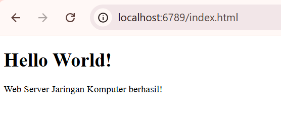
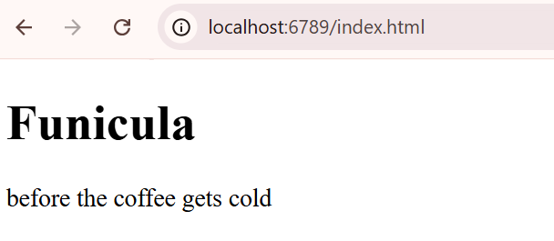

## LAPORAN PRAKTIKUM MODUL 9

#### Nama: Glory Leonthine Angi' - 103072400058

## Tujuan Praktikum:
1. Mahasiswa bisa membuat program web server sederhana berbasis TCP socket 
programming 

## Skeleton Kode Python untuk Web Server
1. buat file **server.py**
2. ketikkan kode berikut:
```python
from socket import *
import sys
import threading

def handle_client(connectionSocket):
  try:
    # menerima pesan dari client dan menampilkanya di server
    message = connectionSocket.recv(1024).decode()
    print(f"Diterima dari client: {message}")
    
    # melakukan operasi yg diminta client
    filename = message.split()[1]
    
    # membuka file dan membaca isinya
    f = open(filename[1: ])
    
    outputdata = f.read()
    
    # kirim respon HTTP 200 OK ke client
    connectionSocket.send(
      "HTTP/1.1 200 OK\r\n\r\n".encode()
    )
    
    # kirim data file ke client
    connectionSocket.sendall(outputdata.encode())
    
    connectionSocket.close()
    
  except IOError:
    connectionSocket.send(
      "HTTP/1.1 404 Not Found\r\n\r\n".encode()
    )
    
    connectionSocket.send(
      "<h1>404 Not Found</h1>".encode()
    )
    
    connectionSocket.close()


serverSocket = socket(AF_INET, SOCK_STREAM)
serverSocket.bind(('', 6789))
serverSocket.listen(5)

print("Server TCP siap menerima koneksi pada port 6789")

while True:
  connectionSocket, addr = serverSocket.accept()
  
  thread = threading.Thread(
    target=handle_client,
    args=(connectionSocket, )
  )
  
  thread.start()
```
### Penjelasan:
- Program diawali dengan pembuatan socket menggunakan protokol TCP, kemudian server di-bind pada port 6789 agar dapat menerima koneksi dari client.
- Server mulai berada dalam kondisi listening, yaitu menunggu permintaan koneksi yang masuk dari client.
- Ketika terdapat client yang terhubung, server menerima koneksi tersebut melalui fungsi accept().
- Untuk setiap koneksi yang diterima, server membuat sebuah thread baru agar dapat menangani beberapa client secara bersamaan (multithreading).
- Di dalam thread, server menerima pesan atau permintaan (request) dari client, yang umumnya berupa permintaan file dengan format HTTP.
- Server kemudian mengekstrak nama file yang diminta dari pesan yang diterima.
- Server mencoba membuka file yang dimaksud:
    - Jika file berhasil ditemukan dan dibuka, server membaca isi file tersebut.
    - Jika file tidak ditemukan, akan terjadi kesalahan (error).
- Apabila file berhasil dibaca, server mengirimkan respons HTTP dengan status 200 OK, kemudian diikuti dengan isi file sebagai data yang dikirimkan ke client.
- Apabila terjadi kesalahan (misalnya file tidak ditemukan), server mengirimkan respons HTTP dengan status 404 Not Found, beserta pesan kesalahan sederhana.
- Setelah proses pengiriman data selesai, koneksi antara server dan client ditutup.
- Server kembali ke kondisi semula untuk menunggu dan melayani koneksi dari client berikutnya.

3. buat file **index.html** dalam folder yang sama dengan server.py
4. ketikkan kode berikut
```html
<!DOCTYPE html>
<html>
<head>
    <title>Web Server Modul 9</title>
</head>
<body>
    <h1>Hello World!</h1>
    <p>Web Server Jaringan Komputer berhasil!</p>
</body>
</html>
```
### Penjelasan:
- Dokumen diawali dengan deklarasi HTML5 (```<!DOCTYPE html>```).
- Elemen ```<head>``` berisi judul halaman yang ditampilkan pada tab browser.
- Elemen ```<body>``` berisi konten utama yang ditampilkan kepada pengguna.
- Judul ditampilkan menggunakan ```<h1>```, sedangkan teks menggunakan ```<p>```.
- Browser menampilkan isi halaman sesuai dengan struktur HTML yang telah dibuat.

5. jalankan file server.py pada terminal.
6. buka browser dan ketikkan url: http://localhost:6789/index.html



#### ket: server berhasil menampilkan pesan yang ada pada file index.html
7. buka browser dan ketikkan url: http://localhost:6789/hai.html


#### ket: server gagal menampilkan pesan dikarenakan file hai.html tidak dapat ditemukan.


## Latihan Tambahan 

File **server.py**
``` from socket import *
import threading
import os

def handle_client(connectionSocket):
    try:
        # menerima request dari client
        message = connectionSocket.recv(1024).decode()
        print("Request:\n", message)

        # ambil nama file
        filename = message.split()[1]
        filepath = filename[1:]  # hapus "/"

        # default ke index.html jika root
        if filepath == "":
            filepath = "index.html"

        # cek apakah file ada
        if os.path.exists(filepath):
            with open(filepath, 'r') as f:
                outputdata = f.read()

            # kirim HTTP 200 OK
            connectionSocket.send("HTTP/1.1 200 OK\r\n\r\n".encode())
            connectionSocket.sendall(outputdata.encode())
        else:
            raise IOError

        connectionSocket.close()

    except:
        # jika file tidak ditemukan
        connectionSocket.send("HTTP/1.1 404 Not Found\r\n\r\n".encode())
        connectionSocket.send("<h1>404 Not Found</h1>".encode())
        connectionSocket.close()

serverSocket = socket(AF_INET, SOCK_STREAM)
serverSocket.bind(('', 6789))
serverSocket.listen(5)

print("Server multithread berjalan di port 6789...")

while True:
    connectionSocket, addr = serverSocket.accept()
    print("Terhubung dari:", addr)

    # buat thread baru untuk setiap client
    thread = threading.Thread(
        target=handle_client,
        args=(connectionSocket,)
    )
    thread.start()
```
file index.html
``` <!DOCTYPE html>
<html>
<head>
    <title>Web Server Modul 9</title>
</head>
<body>
    <h1>Funicula</h1>
    <p>before the coffee gets cold</p>
</body>
</html>
```
1. buka browser dan ketikkan url: http://localhost:6789/index.html



2. buka browser dan ketikkan url: http://localhost:6789/holaa.html


### kesimpulan:
pada latihan ini, server web sederhana berhasil dikembangkan menjadi server multithread yang mampu menangani beberapa permintaan secara bersamaan. dengan penggunaan threading, setiap client dilayani pada thread terpisah sehingga meningkatkan efisiensi dan kinerja server. hasil pengujian menunjukkan bahwa server dapat memberikan respons HTTP dengan benar sesuai permintaan client.