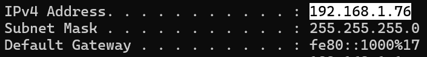
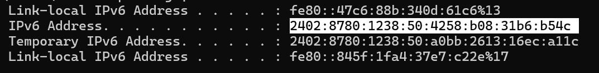
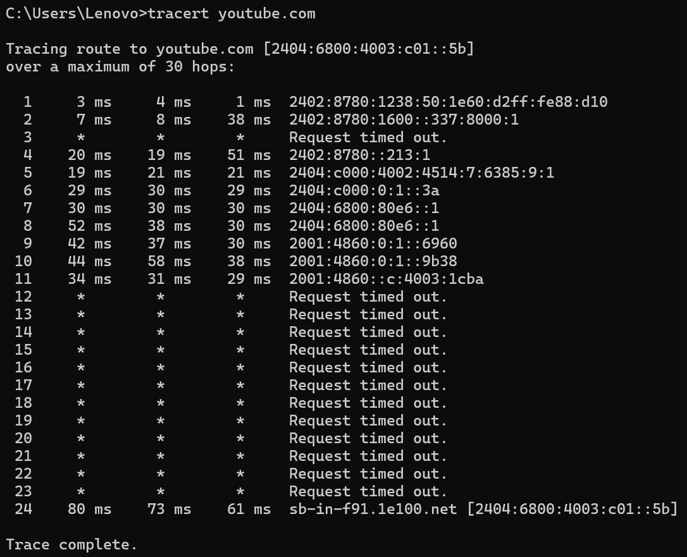
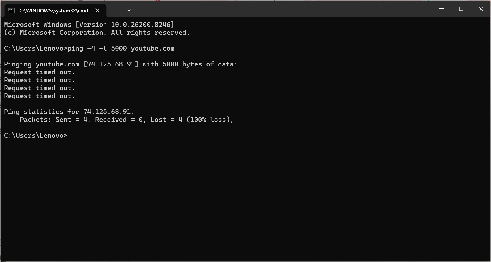
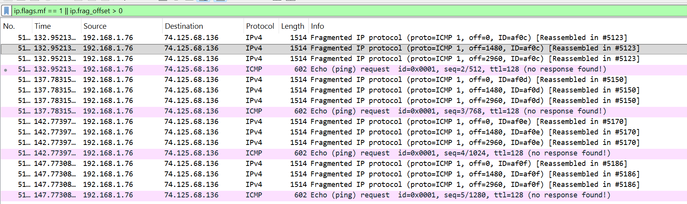
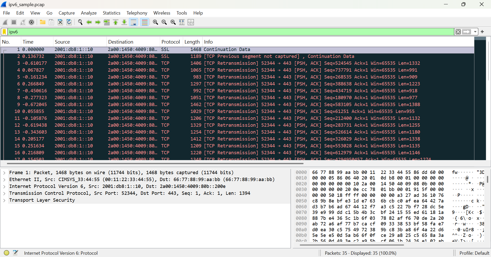

# LAPORAN PRAKTIKUM MODUL 10

#### Nama: Glory Leonthine Angi - 103072400058

## Tujuan:
Mahasiswa dapat menginvestigasi cara kerja protokol IP menggunakan Wireshark

## IP Address
IP address adalah (Internet Protocol Address) adalah alamat unik yang diberikan kepada setiap perangkat yang terhubung ke jaringan komputer. Fungsinya sebagai identitas perangkat agar bisa saling berkomunikasi.
Jenis-jenis IP Address:
1. IPv4 — format 32-bit
contoh:

2. IPv6 — format 128-bit
contoh: 

## Traceroute
Traceroute adalah perintah untuk melacak rute yang dilalui paket data dari perangkat kita menuju server tujuan.
#### Mengamati Traceroute dari Suatu Website
1. Buka cmd
2. Jalankan perintah tracert **youtube.com**

Kesimpulan:
Dari hasil tracert, paket data berhasil mencapai server youtube.com dengan alamat IP **2404:6800:4003:c01::5b** melalui 24 hop menggunakan protokol IPv6. Pada hop 12–23 terdapat Request timed out karena Google memblokir paket ICMP demi keamanan, namun paket tetap berhasil sampai ke tujuan.

## ICMP (Internet Control Message Protocol)
Protokol yang digunakan untuk mengirim pesan error dan informasi kontrol jaringan. Digunakan oleh perintah ping dan traceroute.
Contoh pesan ICMP:
1. Echo Request / Echo Reply: dipakai ping.
2. Destination Unreachable: tujuan tidak dapat dicapai.
3. Time Exceeded: Time To Live(TTL) habis.

## MTU (Maximum Transmission Unit)
Ukuran maksimum paket data (dalam byte) yang dapat dikirim dalam satu transmisi pada suatu jaringan.
1. MTU standar Ethernet: 1500 byte
2. Jika paket melebihi MTU maka paket akan di-fragmentasi

## TTL (Time To Live)
Nilai numerik pada header paket IP yang menentukan berapa kali paket boleh melewati router (hop) sebelum dibuang.
1. Setiap melewati 1 router, TTL akan berkurang 1
2. Jika TTL = 0 → paket dibuang, router mengirim pesan ICMP Time Exceeded
3. TTL default: Windows = 128

## Fragmentasi di Wireshark
Fragmentasi IP terjadi ketika ukuran paket melebihi MTU, sehingga paket dipecah menjadi beberapa bagian (fragment).
Cara melihat di Wireshark:
1. Buka Wireshark
2. Pilih interface wifi
3. Jalankan perintah: ping -4 -l 5000 youtube.com

4. Buka Wireshark dan filter

#### Kesimpulan:
Fragmentasi terjadi karena paket ping sebesar 5000 byte melebihi MTU 1500 byte, sehingga paket dipecah menjadi 3 fragment dengan offset 0, 1480, dan 2960. Hal ini terlihat pada Wireshark dengan ID yang sama (af0c, af0d, af0e, af0f) pada setiap kelompok fragment, membuktikan bahwa ketiga fragment tersebut berasal dari satu paket yang sama.

## IPv6 di Wireshark
1. Buka file ipv6_sample.pcap di wireshark
2. Pada kolom filter di bagian atas, ketik ipv6

Hasil Percobaan:
Dari hasil capture Wireshark menggunakan filter ipv6, berhasil tertangkap paket IPv6 dengan alamat sumber 2001:db8:1::10 menuju alamat tujuan 2a00:1450:4009:80b::200e menggunakan protokol TCP port 443 (HTTPS). Pada bagian detail paket bagian bawah terlihat keterangan Internet Protocol Version 6, yang membuktikan bahwa komunikasi data berjalan menggunakan protokol IPv6.

#### Kesimpulan:
Filter ipv6 pada Wireshark berhasil menampilkan paket-paket yang menggunakan protokol IPv6, berbeda dengan IPv4 yang menggunakan format 32-bit, IPv6 menggunakan format 128-bit sehingga alamatnya jauh lebih panjang seperti yang terlihat pada hasil capture di atas.
