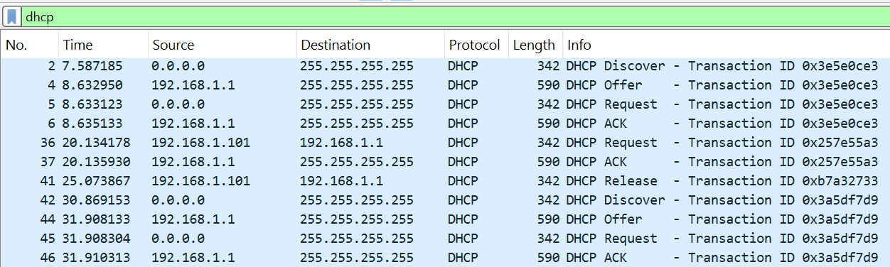

# LAPORAN PRAKTIKUM MODUL 11

#### Nama: Glory Leonthine Angi - 103072400058

## Tujuan:
Mahasiswa dapat menginvestigasi cara kerja protokol DHCP menggunakan Wireshark

## DHCP
DHCP (Dynamic Host Configuration Protocol) adalah protokol jaringan yang secara otomatis memberikan dan mengelola konfigurasi IP kepada perangkat yang terhubung ke jaringan. Tanpa DHCP, administrator harus mengatur IP address setiap perangkat secara manual (static).
DHCP bekerja pada model client-server, di mana DHCP Server menyimpan dan mendistribusikan informasi konfigurasi jaringan seperti:
1. IP Address
2. Subnet Mask
3. Default Gateway
4. DNS Server

## Kelebihan dan kekurangan DHCP
### Kelebihan:
1. Konfigurasi IP otomatis, tidak perlu setting manual satu per satu
2. Mengurangi kemungkinan konflik IP
3. Manajemen jaringan lebih mudah dan efisien
4. IP yang tidak terpakai bisa didaur ulang
5. Cocok untuk jaringan berskala besar

## Kekurangan:
1. Jika DHCP Server mati, semua perangkat tidak bisa mendapatkan IP
2. Kurang cocok untuk perangkat yang membutuhkan IP tetap
3. Rentan terhadap serangan DHCP Spoofing / Rogue DHCP Server
4. Perlu konfigurasi awal yang benar di sisi server

## Proses DORA
DORA adalah singkatan dari 4 tahapan proses yang terjadi ketika DHCP Client meminta IP address kepada DHCP Server, yaitu Discover, Offer, Request, dan Acknowledge.
### Contoh:
1. Download dan ekstrak file dhcp-wireshark-trace1-1.pcapng
2. Buka file menggunakan wireshark
3. Pada kolom filter ketik **dhcp**

#### Penjelasan:
1. Discover (No. 2)
Client dengan IP 0.0.0.0 mengirim broadcast ke 255.255.255.255 karena belum memiliki IP address, client mencari DHCP Server yang aktif di jaringan.
2. Offer (No. 4)
DHCP Server di 192.168.1.1 merespons dengan mengirim penawaran IP address ke client melalui broadcast 255.255.255.255.
3. Request (No. 5)
Client dengan IP 0.0.0.0 mengirim pesan Request secara broadcast ke 255.255.255.255 sebagai tanda menyetujui dan meminta IP yang telah ditawarkan oleh server.
4. Acknowledge (No. 6)
DHCP Server di 192.168.1.1 mengirim pesan ACK sebagai konfirmasi bahwa IP address resmi diberikan kepada client. Setelah tahap ini, client sudah dapat menggunakan IP tersebut untuk berkomunikasi di jaringan.
